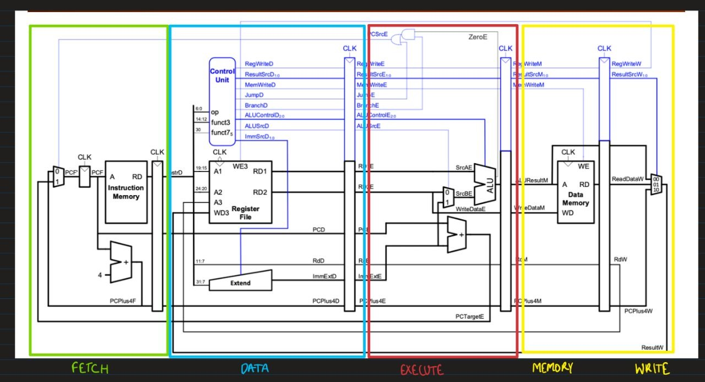

## Table of contents:

## Evidence 


## Team members:

```
Chong, Clarke 
Khanna, Partha
Ng, Joel
Aubeeluck,Kevin 
```

## Contribution Tables

### Single Cycle CPU


### Pipelined CPU

Fetch - Joel \
Data - Partha\
Execute - Clarke\
Memory - Kevin

Key: * = Created ** = Edited

| Task | Files| Clarke | Partha | Joel | Kevin |
| ---- | ---- | ---- | ---- | ---- | ---- |
| <u>**Single cycle** | ---- | ---- | ---- | ---- | ---- |
| Fetch | instr_mem.sv,<br>pc_register.sv,<br>adder.sv,<br>mux.sv,<br>  | ---- | ---- | ---- | ---- |
| Data | control.sv,<br>reg_file,<br>signextend.sv | ---- | ---- | ---- | ---- |
| Execute | alu.sv,<br>mux.sv | ---- | ---- | ---- | ---- |
| Memory/Write | datamem.sv,<br>mux_4x2.sv  | ---- | ---- | ---- | ---- |
| Integration | top.sv,<br>sim_execute.cpp | ---- | ---- | ---- | ---- |
| <u>**Pipelining** | ---- | ---- | ---- | ---- | ---- |
| <u>**Cache** | ---- | ---- | ---- | ---- | ---- |
| Git | ---- | ---- | ---- | ---- | ---- |


## Joint Statement of Contribution


Below we have tasks at a glance
#### Clarke: 

Tasks:
- Task 1 
	- Explanation
- Task 2 
	- Explanation

#### Partha: 

Tasks:
- Task 1 
	- Explanation
- Task 2 
	- Explanation

#### Joel: 

Tasks:
- Task 1 
	- Explanation
- Task 2 
	- Explanation

#### Kevin: 

Tasks:
- Task 1 
	- Explanation
- Task 2 
	- Explanation


## Project Goalposts 

### Goal 1: Single-Cycle RV321 implentation of F1 lights 
### Stretch Goal 1: Pipelined RV321 Design
### Stretch Goal 2: Adding Data Memory Cache
### Stretch Goal 3: Full RV32I Design

