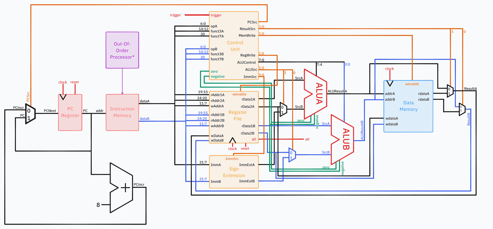

# Table of contents:

- [Single Cycle CPU Implementation](#single-cycle)
- [Pipelined CPU Implementation](#pipelined-cpu)
- [Cached Implementation](#)
- [Complete RISC-V](#)
- [Superscalar Processor]()


# Quick Start

We completed the Single-Cycle and all of the stretch goals (Pipelined, Two-Way Set Associative Write-Back Cache, Full RV32I Design). Further, we also embarked on an extension project in designing a dual-ALU superscalar processor. They can be found in the following branches:
| Branch | Description |
| ------ | ----------- |
|`main` | Single-Cycle Implementation |
|`pipelined` | Pipelined (+ Full RV32I Implementation) Implementation |
|`cache` | Cache + Single-Cycle Implementation |
|`complete` | Pipelined + Cache + Full RV32I Implementation |
|`superscalar` | Superscalar Implementation |

<br>

The following instructions are accurate for all versions of our implementation, execpt for `superscalar`. Specific instructions on testing it can be found within the `superscalar` branch itself.

For the versions with full RV32I implementation, we have also written extra test cases to test full functionality, called along with the provided test in `doit.sh`. Please refer to the respective branch `README.md` documents for more information.

To access each version,
```bash
git checkout <branch-name>
```

#### Quick Start - GTest Testing

To run the provided tests within the target branch,
```bash
 cd ./tb
 ./doit.sh
```

To run the tests we wrote for individual components (while in `./tb/`),
```
./run_our_tests.sh
```

The script above runs all of our tests. However, the individual C++ testbenches can be found in `./tb/our_tests` and are written with GTest. The scripts to run them are found in `./tb/bash`, where they are named similarly.

#### Quick Start - Vbuddy Tests

##### **Windows only**: remember to include `~/Documents/iac/lab0-devtools/tools/attach_usb.sh` command to connect Vbuddy.

To run the f1 light test within the `./tb/` folder,

```bash
sudo chmod +x f1_test.sh
./f1_test.sh
```

To run the pdf test within the `./tb/` folder,
```bash
sudo chmod +x pdf_test.sh
./pdf_test.sh
```

Both `cpp` scripts can be found in `./tb/vbuddy_test`. The distribution for the pdf test can be changed by overwriting the distribution name in `./tb/vbuddy_test/pdf_tb.cpp` in line 13.
```cpp
// can change to "noisy" or "triangle"
const std::string distribution = "gaussian"; 
```

### Top Level Contributions

| Section               | Clarke | Joel | Kevin | Partha |
| --------------------- | ------ | ---- | ----- | ------ |
| Single cycle          |        |      |       |        |
| Pipelining            |        |      |       |        |
| Cache                 |        |      |       |        |
| Integration           |        |      |       |        |
| Superscalar Processor |        |      |       |        |

`X` - Lead Contributor   `*` - Partial Contributor
## Team members and Statements:

| Team Member     | GitHub                                                | CID      | Email           | Link to Personal Statement                        |
| --------------- | ----------------------------------------------------- | -------- | --------------- | ------------------------------------------------- |
| Clarke Chong    | [clarkechong](https://github.com/clarkechong)         | 02395382 | cc1823@ic.ac.uk | [Clarke's Statement](statements/ClarkeChong.md)   |
| Joel Ng         | [energy-in-joles](https://github.com/energy-in-joles) | 02193809 | zjn22@ic.ac.uk  | [Joel's Statement](statements/JoelNg.md)          |
| Kevin Aubeeluck | [Kevinaubeeluck](https://github.com/Kevinaubeeluck)   |          |                 | [Kevin's Statement](statements/KevinAubeeluck.md) |
| Partha Khanna   | [parthak314](https://github.com/parthak314)           | 02374670 | pk1223@ic.ac.uk | [Partha's Statement](statements/ParthaKhanna.md)  |

# Single Cycle
### Overview
This single cycle implementation covers the basic requirements for most CPU operations, this implements the following instructions: `R-type`, `I-type (immediate)`, `lbu`, `sb`, `beq`, `bne`, `jal`, `jalr`, `lui`.
## Schematic


### Contributions

| Module                       | Clarke | Joel | Kevin | Partha |
| ---------------------------- | ------ | ---- | ----- | ------ |
| alu                          |        |      |       |        |
| instr_mem                    |        |      |       |        |
| pc_register                  |        |      |       |        |
| datamem                      |        |      |       |        |
| control                      |        |      |       |        |
| reg_file                     |        |      |       |        |
| signextend                   |        |      |       |        |
| top (system integration)     |        |      |       |        |
| F1 Assembly.s                |        |      |       |        |
| System Testing and Debugging |        |      |       |        |
| PDF testing                  |        |      |       |        |
| F1 Testing                   |        |      |       |        |

`X` - Lead Contributor   `*` - Partial Contributor

## File Structure

```
.
├── rtl
│   ├── adder.sv
│   ├── decode
│   │   ├── control.sv
│   │   ├── decode_top.sv
│   │   ├── reg_file.sv
│   │   └── signextend.sv
│   ├── execute
│   │   ├── alu.sv
│   │   └── execute_top.sv
│   ├── fetch
│   │   ├── fetch_top.sv
│   │   ├── instr_mem.sv
│   │   └── pc_register.sv
│   ├── memory
│   │   ├── datamem.sv
│   │   └── memory_top.sv
│   ├── mux.sv
│   ├── mux_4x2.sv
│   └── top.sv
└── tb
    ├── asm
    │   ├── 1_addi_bne.s
    │   ├── 2_li_add.s
    │   ├── 3_lbu_sb.s
    │   ├── 4_jal_ret.s
    │   ├── 5_pdf.s
    │   ├── f1_fsm.s
    │   └── f1_fsm_simplified.s
    ├── assemble.sh
    ├── bash
    │   ├── control_test.sh
    │   ├── decode_top_test.sh
    │   ├── execute_test.sh
    │   ├── fetch_test.sh
    │   ├── memory_test.sh
    │   ├── reg_file_test.sh
    │   └── sign_extend_test.sh
    ├── doit.sh
    ├── f1_test.sh
    ├── our_tests
    │   ├── control_test_tb.cpp
    │   ├── datamem_tb.cpp
    │   ├── decode_top_test_tb.cpp
    │   ├── execute_tb.cpp
    │   ├── fetch_tb.cpp
    │   ├── memory_tb.cpp
    │   ├── reg_file_test_tb.cpp
    │   └── signextend_test_tb.cpp
    ├── pdf_test
    ├── pdf_test.sh
    ├── reference
    ├── test_out
    │   ├── 1_addi_bne
    │   ├── 2_li_add
    │   ├── 3_lbu_sb
    │   ├── 4_jal_ret
    │   ├── 5_pdf
    │   └── obj_dir
    ├── tests
    │   ├── cpu_testbench.h
    │   └── verify.cpp
    ├── two_way_cache_top.vcd
    ├── vbuddy.cfg
    ├── vbuddy_test
    │   ├── f1_fsm_tb.cpp
    │   ├── pdf_tb.cpp
    │   └── vbuddy.cpp
    └── verification.md
```

Note: only for this version, is the `tb` folder shown, this contains the tests and shows all other execution files

## Implementation

## Testing
==All Videos==
### F1
### PDF: Gaussian
### PDF: Noisy
### PDF: Triangle

For the PDF tests, there were initially several waveforms that were elongated. But this can be rectified by displaying the value every 3 clock cycles, as opposed to every clock cycle. We can do this by the following lines:
```cpp
bool is_paused = vbdFlag();
      top->trigger = is_paused;
      if (!is_paused) {
          j++;
          displaying = true;
          if (j % 3 == 0) {
            vbdCycle(j);
            vbdPlot(top->a0, 0, 255);
          }
      }
```
The entire program is still running every cycle, but display is changed to updating every 3 cycles.

---
# Pipelined RISCV CPU

## Overview

## Schematic

## Contributions

| Module | Clarke | Joel | Kevin | Partha |
| ------ | ------ | ---- | ----- | ------ |
|        |        |      |       |        |
|        |        |      |       |        |
|        |        |      |       |        |
|        |        |      |       |        |
|        |        |      |       |        |
|        |        |      |       |        |
|        |        |      |       |        |
|        |        |      |       |        |
|        |        |      |       |        |
|        |        |      |       |        |
|        |        |      |       |        |
|        |        |      |       |        |

`X` - Lead Contributor   `*` - Partial Contributor
## File Structure
```
.
├── rtl
│   ├── decode
│   │   ├── control_unit.sv
│   │   ├── control_unit.txt
│   │   ├── decode_pipeline_regfile.sv
│   │   ├── decode_top.sv
│   │   ├── register_file.sv
│   │   └── sign_ext.sv
│   ├── execute
│   │   ├── alu.sv
│   │   ├── branch_logic.sv
│   │   ├── execute_pipeline_regfile.sv
│   │   ├── execute_top.sv
│   │   └── hazard_unit.sv
│   ├── fetch
│   │   ├── fetch_pipeline_regfile.sv
│   │   ├── fetch_top.sv
│   │   ├── fetch_top.txt
│   │   ├── instr_mem.sv
│   │   ├── pc_register.sv
│   │   └── pc_register.txt
│   ├── general-purpose
│   │   ├── adder.sv
│   │   ├── hazard_unit.txt
│   │   ├── mux.sv
│   │   ├── mux3.sv
│   │   └── mux4.txt
│   ├── memwrite
│   │   ├── data_mem.sv
│   │   ├── loadstore_parsing_unit.sv
│   │   ├── memwrite_pipeline_regfile.sv
│   │   └── memwrite_top.sv
│   ├── top-module-interfaces
│   │   ├── interfaceD.sv
│   │   ├── interfaceE.sv
│   │   ├── interfaceM.sv
│   │   └── interfaceW.sv
│   └── top.sv
├── simple-tb
│   ├── check-syntax.sh
│   ├── hex.txt
│   ├── playground_tb.cpp
│   └── run-playground.sh
└── tb
```
## Implementation
The following stages have been added on top of the basic RISC-V model (single cycle):
- Pipeline Registers between all stages
    - storing instruction data, intermediate data, control signals
- control unit
    - generate pipelined control signals
    - hazard detection and forwarding controls, data dependencies and when to forward or stall
- Hazard detection unit
    - compare source reg of current instr in decode with destination reg in execute, mem and writeback
    - stall/forward signals as needed
- Multiplexers for forwarding
    - at ALU inputs to choose between reg file vs forwarded data from Execute/memory or memory/writeback pipeline reg
- Flushing
    - if a branch is taken, clear instr in pipeline that have not been executed -> replace with nop

## Testing

---
# Data Memory Cache

## Overview

## Schematic

## Contributions

| Module                       | Clarke | Joel | Kevin | Partha |
| ---------------------------- | ------ | ---- | ----- | ------ |
| memory_top.sv                |        | `X`  |       |        |
| ram2port.sv                  |        | `X`  |       | `*`    |
| sram.sv                      |        | `X`  |       |        |
| cache controller             |        | `X`  |       | `X`    |
| System Testing and Debugging |        | `X`  |       | `X`    |

`X` - Lead Contributor   `*` - Partial Contributor
## File Structure
```
.
├── rtl
│   ├── adder.sv
│   ├── decode
│   │   ├── control.sv
│   │   ├── decode_top.sv
│   │   ├── reg_file.sv
│   │   └── signextend.sv
│   ├── execute
│   │   ├── alu.sv
│   │   └── execute_top.sv
│   ├── fetch
│   │   ├── fetch_top.sv
│   │   ├── instr_mem.sv
│   │   └── pc_register.sv
│   ├── memory
│   │   ├── memory_top.sv
│   │   ├── ram2port.sv
│   │   ├── sram.sv
│   │   ├── two_way_cache_controller.sv
│   │   └── two_way_cache_top.sv
│   ├── mux.sv
│   ├── mux_4x2.sv
│   └── top.sv
└── tb
```
## Implementation

## Testing

---
# Complete RISCV CPU

## Overview

## Schematic

## Contributions

| Module | Clarke | Joel | Kevin | Partha |
| ------ | ------ | ---- | ----- | ------ |
|        |        |      |       |        |
|        |        |      |       |        |
|        |        |      |       |        |
|        |        |      |       |        |
|        |        |      |       |        |
|        |        |      |       |        |
|        |        |      |       |        |
|        |        |      |       |        |
|        |        |      |       |        |
|        |        |      |       |        |
|        |        |      |       |        |
|        |        |      |       |        |

`X` - Lead Contributor   `*` - Partial Contributor
## File Structure

## Implementation

## Testing

---
# Superscalar RISCV CPU

## Overview

## Schematic

## Contributions

| Module | Clarke | Joel | Kevin | Partha |
| ------ | ------ | ---- | ----- | ------ |
|        |        |      |       |        |
|        |        |      |       |        |
|        |        |      |       |        |
|        |        |      |       |        |
|        |        |      |       |        |
|        |        |      |       |        |
|        |        |      |       |        |
|        |        |      |       |        |
|        |        |      |       |        |
|        |        |      |       |        |
|        |        |      |       |        |
|        |        |      |       |        |

`X` - Lead Contributor   `*` - Partial Contributor
## File Structure

## Implementation
### Hardware
Structural design modifications:
- <span style="color:#eaa19f">Fetch</span>: No change from previous model, output is now `dataA` and `dataB` - selecting consecutive instructions from the Out-Of-Order Processor.
- <span style="color:#e9b76e">Decode</span>: Doubled inputs for each block
- <span style="color:red">Execute</span>: Replicated models for ALU
- <span style="color:#a9caf2">Writeback</span>: Doubled inputs for Data Memory with Load store separate to the data memory to reflect changes in the pipelining section. This is the load store parsing unit. A separate mux for `ResultSrc`. 
Given the time available, this model implements the instructions for `R-type`, `I-type (imm)`

### Out-of-order Processor
The key change here is the Out-Of-Order Processor which is a C++ script (and a Python script that our team originally wrote in). It is compiled and run right before `assemble.sh` in the `doit.sh` script to optimise the assembly for the superscalar processor.
The High level requirements for this file are to:
- Create a dependency graph of all instructions by checking if linking each instruction with preceding instructions based on register data dependencies.
- Create a priority queue based on the number of dependencies that each instruction has.
- Reorganise the instructions based on which has the highest priority (most dependencies), while ensuring no dependency requirement is violated.
- Reassemble this into a new assembly file that is ready to be converted to machine code with `assembly.sh`.
This then follows the same procedure to assemble the instruction set (by `assemble.sh` via the `riscv gnu toolchain`) before inputting this into instruction memory, as shown above.

Further details can be seen in individual reports (Partha, Joel).

## Testing

