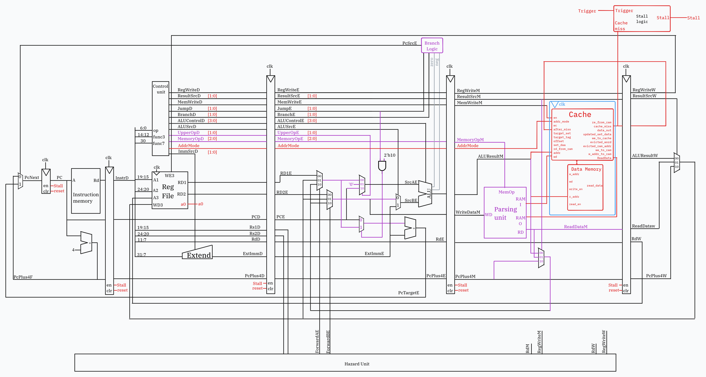
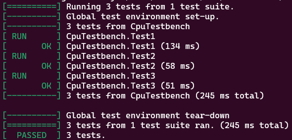

# Pending changes
- [ ] Pipelined Sections
	- [ ] Schematic to be added - Kevin
	- [ ] Implementation - Clarke
	- [ ] Testing - Clarke
- [ ] Complete
	- [ ] Schematics - Kevin
	- [ ] Implementation - Clarke/Joel
	- [ ] Testing - Clarke/Joel


# Table of contents:

- Quick Start
- [Single Cycle CPU Implementation](#single-cycle)
- [Pipelined CPU Implementation](#pipelined-cpu)
- [Cached Implementation](#)
- [Complete RISC-V](#)
- [Superscalar Processor]()
- Appendix

# Quick Start

We completed the Single-Cycle and all of the stretch goals (Pipelined, Two-Way Set Associative Write-Back Cache, Full RV32I Design). Further, we also embarked on an extension project in designing a dual-ALU superscalar processor. They can be found in the following branches:
| Branch | Description |
| ------ | ----------- |
|`main` | Single-Cycle Implementation |
|`pipelined` | Pipelined (+ Full RV32I Implementation) Implementation |
|`cache` | Cache + Single-Cycle Implementation |
|`complete` | Pipelined + Cache + Full RV32I Implementation |
|`superscalar` | Superscalar Implementation |
|`reduced-riscv` | Simplified version of the RISC-V processor (lab 4) |

<br>

The following instructions are accurate for all versions of our implementation, execpt for `superscalar`. Specific instructions on testing it can be found within the `superscalar` branch itself.

For the versions with full RV32I implementation, we have also written extra test cases to test full functionality, called along with the provided test in `doit.sh`. Please refer to the respective branch `README.md` documents for more information.

To access each version,
```bash
git checkout <branch-name>
```

### **IMPORTANT:** Please run all testbench scripts while in `/tb`. For simplicity, testbenches were written with absolute path referenced from `/tb`.

#### Quick Start - GTest Testing

To run the provided tests within the target branch,
```bash
 cd ./tb
 ./doit.sh
```

For unit testing each module top (fetch_top, decode_top, execute_top, memory_top), we wrote individual C++ testbenches written with GTest that can be found in `./tb/our_tests`. The scripts to run them are found in `./tb/bash`, where they are named similarly. However, please run them while in `./tb` and not in `./tb/bash`. To run the tests we wrote for individual components (while in `./tb/`):

```bash
sudo chmod +x ./bash/<unit_test>.sh
./bash/<unit_test>.sh
```

#### Quick Start - Vbuddy Tests

##### **Windows only**: remember to include `~/Documents/iac/lab0-devtools/tools/attach_usb.sh` command to connect Vbuddy.

To run the f1 light test within the `./tb/` folder,

```bash
sudo chmod +x f1_test.sh
./f1_test.sh
```

To run the pdf test within the `./tb/` folder,
```bash
sudo chmod +x pdf_test.sh
./pdf_test.sh
```

Both `cpp` scripts can be found in `./tb/vbuddy_test`. The distribution for the pdf test can be changed by overwriting the distribution name in `./tb/vbuddy_test/pdf_tb.cpp` in line 13.
```cpp
// can change to "noisy" or "triangle"
const std::string distribution = "gaussian"; 
```

### Top Level Contributions

| Section               | Clarke | Joel | Kevin | Partha |
| --------------------- | ------ | ---- | ----- | ------ |
| Repo Setup            |        |      |       | `X`    |
| Single cycle          | `X`    | `X`  | `X`   | `X`    |
| Pipelining            | `X`    | `*`  | `X`   | `*`    |
| Cache                 |        | `X`  |       | `X`    |
| Integration           | `X`    | `X`  | `*`   | `*`    |
| Superscalar Processor |        | `X`  |       | `X`    |

`X` - Lead Contributor   `*` - Partial Contributor
## Team members and Statements:

| Team Member     | GitHub                                                | CID      | Email           | Link to Personal Statement                        |
| --------------- | ----------------------------------------------------- | -------- | --------------- | ------------------------------------------------- |
| Clarke Chong    | [clarkechong](https://github.com/clarkechong)         | 02395382 | cc1823@ic.ac.uk | [Clarke's Statement](statements/ClarkeChong.md)   |
| Joel Ng         | [energy-in-joles](https://github.com/energy-in-joles) | 02193809 | zjn22@ic.ac.uk  | [Joel's Statement](statements/JoelNg.md)          |
| Kevin Aubeeluck | [Kevinaubeeluck](https://github.com/Kevinaubeeluck)   |02467502|ka1423@ic.ac.uk| [Kevin's Statement](statements/KevinAubeeluck.md) |
| Partha Khanna   | [parthak314](https://github.com/parthak314)           | 02374670 | pk1223@ic.ac.uk | [Partha's Statement](statements/ParthaKhanna.md)  |

# Single Cycle
### Overview
This single cycle implementation covers the basic requirements for most CPU operations, this implements the following instructions: `R-type`, `I-type (immediate)`, `lbu`, `lw`, `sb`, `sw`, `beq`, `bne`, `jal`, `jalr`, `lui`.
## Schematic


### Contributions

| Module                       | Clarke | Joel | Kevin | Partha |
| ---------------------------- | ------ | ---- | ----- | ------ |
| alu                          | `X`    |      |       |        |
| instr_mem                    |        | `X`  |       |        |
| pc_register                  |        | `X`  |       |        |
| datamem                      |        |      | `X`   |        |
| control                      |        |      |       | `X`    |
| reg_file                     |        |      |       | `X`    |
| signextend                   |        |      |       | `X`    |
| top (system integration)     | `*`    | `X`  | `*`   | `*`    |
| F1 Assembly.s                |        |      |       | `X`    |
| System Testing and Debugging |        | `X`  |       | `X`    |
| PDF testing                  |        | `X`  |       | `*`    |
| F1 Testing                   |        | `X`  |  `*`  | `X`    |

`X` - Lead Contributor   `*` - Partial Contributor

## File Structure

```
.
├── rtl
│   ├── adder.sv
│   ├── decode
│   │   ├── control.sv
│   │   ├── decode_top.sv
│   │   ├── reg_file.sv
│   │   └── signextend.sv
│   ├── execute
│   │   ├── alu.sv
│   │   └── execute_top.sv
│   ├── fetch
│   │   ├── fetch_top.sv
│   │   ├── instr_mem.sv
│   │   └── pc_register.sv
│   ├── memory
│   │   ├── datamem.sv
│   │   └── memory_top.sv
│   ├── mux.sv
│   ├── mux_4x2.sv
│   └── top.sv
└── tb
    ├── asm
    │   ├── 1_addi_bne.s
    │   ├── 2_li_add.s
    │   ├── 3_lbu_sb.s
    │   ├── 4_jal_ret.s
    │   ├── 5_pdf.s
    │   ├── f1_fsm.s
    │   └── f1_fsm_simplified.s
    ├── assemble.sh
    ├── bash
    │   ├── control_test.sh
    │   ├── decode_top_test.sh
    │   ├── execute_test.sh
    │   ├── fetch_test.sh
    │   ├── memory_test.sh
    │   ├── reg_file_test.sh
    │   └── sign_extend_test.sh
    ├── doit.sh
    ├── f1_test.sh
    ├── our_tests
    │   ├── control_test_tb.cpp
    │   ├── datamem_tb.cpp
    │   ├── decode_top_test_tb.cpp
    │   ├── execute_tb.cpp
    │   ├── fetch_tb.cpp
    │   ├── memory_tb.cpp
    │   ├── reg_file_test_tb.cpp
    │   └── signextend_test_tb.cpp
    ├── pdf_test
    ├── pdf_test.sh
    ├── reference
    ├── test_out
    │   ├── 1_addi_bne
    │   ├── 2_li_add
    │   ├── 3_lbu_sb
    │   ├── 4_jal_ret
    │   ├── 5_pdf
    │   └── obj_dir
    ├── tests
    │   ├── cpu_testbench.h
    │   └── verify.cpp
    ├── two_way_cache_top.vcd
    ├── vbuddy.cfg
    ├── vbuddy_test
    │   ├── f1_fsm_tb.cpp
    │   ├── pdf_tb.cpp
    │   └── vbuddy.cpp
    └── verification.md
```

The processor development is done in the register transfer level (`rtl`) folder and the testing is performed in the test bench folder (`tb`).
The test bench folder contains:
- Assembly files (1 to 5 provided and f1_fsm) - in later versions
- `assemble.sh` - translating RISCV assembly to machine code
- `bash` and `out_tests` - independently created testing cases for individual components
- `vbuddy_test` - Tests creating to verify RISCV performance with VBuddy (provided)
Other files are either a result of these files (testing outputs e.g. `*.vcd`) or were provided.

Note: only for this version, is the `tb` folder shown, this contains the tests and shows all other execution files

## Implementation
Instructions implemented:

| Type     | Instruction                                                    |
| -------- | -------------------------------------------------------------- |
| R        | `add` `sub` `xor` `or` `and` `sll` `srl` `sra` `slt` `sltu`    |
| I (ALU)  | `addi` `xori` `ori` `andi` `slli` `srli` `srai` `slti` `sltiu` |
| I (load) | `lbu` `lw`                                                     |
| I (jump) | `jalr`                                                         |
| S        | `sb` `sw`                                                      |
| B        | `beq` `bne`                                                    |
| U        | `lui`                                                          |
| J        | `jal`                                                          |

## Testing
### Test cases
For the tests provided (`1_addi_bne` `2_li_add` `3_lbu_sb` `4_jal_ret` `5_pdf`):

### F1
==ADD TESTING==

### PDF: Gaussian
https://github.com/user-attachments/assets/ea8e738c-7042-4297-840e-35a427eaf2c0

### PDF: Noisy
https://github.com/user-attachments/assets/cfd5bc62-d1f2-445f-99db-e14eacb9b977

### PDF: Triangle
https://github.com/user-attachments/assets/f4134cbb-5490-4b97-a8ce-6705e8a41cf7

For the PDF tests, there were initially several waveforms that were elongated. But this can be rectified by displaying the value every 3 clock cycles, as opposed to every clock cycle. We can do this by the following lines:
```cpp
bool is_paused = vbdFlag();
      top->trigger = is_paused;
      if (!is_paused) {
          j++;
          displaying = true;
          if (j % 3 == 0) {
            vbdCycle(j);
            vbdPlot(top->a0, 0, 255);
          }
      }
```
The entire program is still running every cycle, but display is changed to updating every 3 cycles.

---
# Pipelined RISCV CPU

## Schematic


## Overview

# Abstract: Pipelining in RISC-V Processors

Pipelining is used to enhance performance by dividing instruction execution into stages: Fetch, Decode, Execute, Memory, and Writeback, thus enabling parallel execution of multiple instructions. This reduces overall execution time while maintaining individual instruction latency. 
Challenges such as data hazards, control hazards, structural hazards are mitigated using techniques like data forwarding, stalling, and flushing. Pipelining significantly improves throughput, achieving faster program execution compared to single-cycle designs.
## Schematic

## Contributions

| Module                     | Clarke | Joel | Kevin | Partha |
| -------------------------- | ------ | ---- | ----- | ------ |
| Decode block               |        |      |       | `X`    |
| Execute block              | `X`    |      |       |        |
| Fetch block                |        | `X`  |       |        |
| Memory block             | `*`    |      | `X`   |        |
| Decode pipeline register   |        |      |       | `X`    |
| Execute pipeline register  | `X`    |      |       |        |
| Fetch pipeline register    |        | `X`  |       |        |
| Memory pipeline register |        |      | `X`   |        |
| System Integration         | `X`    |      | `X`   |        |
| Testing and Debugging      | `X`    |      | `X`   |        |

`X` - Lead Contributor   `*` - Partial Contributor
## File Structure
```
.
├── rtl
│   ├── decode
│   │   ├── control_unit.sv
│   │   ├── decode_pipeline_regfile.sv
│   │   ├── decode_top.sv
│   │   ├── register_file.sv
│   │   └── sign_ext.sv
│   ├── execute
│   │   ├── alu.sv
│   │   ├── branch_logic.sv
│   │   ├── execute_pipeline_regfile.sv
│   │   ├── execute_top.sv
│   │   └── hazard_unit.sv
│   ├── fetch
│   │   ├── fetch_pipeline_regfile.sv
│   │   ├── fetch_top.sv
│   │   ├── instr_mem.sv
│   │   └── pc_register.sv
│   ├── general-purpose
│   │   ├── adder.sv
│   │   ├── mux.sv
│   │   └── mux3.sv
│   ├── memory
│   │   ├── data_mem.sv
│   │   ├── loadstore_parsing_unit.sv
│   │   ├── memory_pipeline_regfile.sv
│   │   └── memory_top.sv
│   ├── top-module-interfaces
│   │   ├── interfaceD.sv
│   │   ├── interfaceE.sv
│   │   ├── interfaceM.sv
│   │   └── interfaceW.sv
│   └── top.sv
└── tb
```
## Implementation
==TO CHANGE==
The following stages have been added on top of the basic RISC-V model (single cycle):
- Pipeline Registers between all stages
    - storing instruction data, intermediate data, control signals
- control unit
    - generate pipelined control signals
    - hazard detection and forwarding controls, data dependencies and when to forward or stall
- Hazard detection unit
    - compare source reg of current instr in decode with destination reg in execute, mem and writeback
    - stall/forward signals as needed
- Multiplexers for forwarding
    - at ALU inputs to choose between reg file vs forwarded data from Execute/memory or memory/writeback pipeline reg
- Flushing
    - if a branch is taken, clear instr in pipeline that have not been executed -> replace with nop

## Testing

---
# Data Memory Cache

## Overview

Cache memory in RISC-V employs direct-mapped, set-associative, or fully associative mapping to determine data placement, in this implementation we utilise 2-way set associative cache.
**Tags** and **valid bits** identify cached data, while **replacement policies** like LRU handle evictions. Write policies such as **write-through** and **write-back** manage consistency between cache and memory.
These techniques ensure efficient data access, reducing latency and leveraging locality principles for optimised performance.  
## Schematic

## Contributions

| Module                       | Clarke | Joel | Kevin | Partha |
| ---------------------------- | ------ | ---- | ----- | ------ |
| memory_top.sv                |        | `X`  |       |        |
| ram2port.sv                  |        | `X`  |       | `*`    |
| sram.sv                      |        | `X`  |       |        |
| cache controller             |        | `X`  |       | `X`    |
| System Testing and Debugging |        | `X`  |       | `X`    |

`X` - Lead Contributor   `*` - Partial Contributor
## File Structure
```
.
├── rtl
│   ├── adder.sv
│   ├── decode
│   │   ├── control.sv
│   │   ├── decode_top.sv
│   │   ├── reg_file.sv
│   │   └── signextend.sv
│   ├── execute
│   │   ├── alu.sv
│   │   └── execute_top.sv
│   ├── fetch
│   │   ├── fetch_top.sv
│   │   ├── instr_mem.sv
│   │   └── pc_register.sv
│   ├── memory
│   │   ├── memory_top.sv
│   │   ├── ram2port.sv
│   │   ├── sram.sv
│   │   ├── two_way_cache_controller.sv
│   │   └── two_way_cache_top.sv
│   ├── mux.sv
│   ├── mux_4x2.sv
│   └── top.sv
└── tb
```
## Implementation
The two-way set-associative cache design consists of the following components:
1. Cache Controller:
    - Manages cache operations such as hits, misses, evictions, and updates.
    - Tracks the valid bits, dirty bits, and tags for each block in a set.
    - Uses an LRU (Least Recently Used) bit to determine which block to evict on a miss.
    - Handles read and write operations:
        - On a cache hit, data is retrieved or updated directly in the cache.
        - On a cache miss, the controller fetches the data from RAM, updates the cache, and potentially writes back evicted data if dirty.
2. Top Module (For cache):
    - Instantiates the cache controller and connects it to the SRAM.
    - Extracts the set index, tag, and byte offset from the input address.
    - Handles interactions between the cache controller and the SRAM, ensuring consistency between cache and main memory.
3. **Cache Structure**:
    - Each set contains:
        - Two data blocks with corresponding valid, dirty, and tag bits.
        - An LRU bit to track usage.
    - Designed to store 32-bit data across 512 sets (1024 words in total).

This implementation efficiently handles data locality with low-latency access on hits and ensures correctness during evictions using write-back and read-through policies.

## Testing

  For unit testing, we initially setup the environment to provide clear debug information and supports waveform analysis for issue tracking with gtkwave and also outputting variable status in between. We were then able to analyse the following through test cases:
- Basic read and write operations perform correctly in isolation.
- Proper handling of read and write hits for word and byte addressing.
- Eviction Logic
- Write Miss Handling
- LRU Replacement policy and fetching from memory

Moving onto the given test cases, we can see that the complete execution takes 646 ms in comparison to the 1054 ms for the single cycle model.


---
# Complete RISCV CPU

## Overview
The complete system integration for a RISC-V project involves implementing all instructions defined by the RISC-V instruction set architecture (ISA).
Here, we integrate a cache system to enhance memory access speed and reduce latency (seen in the `cache` branch. 
Pipelining is incorporated to improve throughput by enabling the concurrent execution of multiple instructions (from `pipelined` branch).  
The design ensures that each component, including the cache and pipeline, operates cohesively for optimal performance. This integration results in a high-performance RISC-V processor capable of handling complex tasks efficiently.
## Schematic


## Contributions

| Module                     | Clarke | Joel | Kevin | Partha |
| -------------------------- | ------ | ---- | ----- | ------ |
| execute_top                | `X`    |      |       |        |
| fetch_top                  |        | `X`  |       |        |
| memory_top               |        |      | `X`   |        |
| decode_top                 |        |      |       | `X`    |
| memory cache integration | `X`    | `X`  |       |        |
| System integration         | `X`    | `X`  |       |        |
| Testing and Debugging      | `X`    | `X`  |       |        |


`X` - Lead Contributor   `*` - Partial Contributor
## File Structure
```
.
├── rtl
│   ├── decode
│   │   ├── control_unit.sv
│   │   ├── decode_pipeline_regfile.sv
│   │   ├── decode_top.sv
│   │   ├── register_file.sv
│   │   └── sign_ext.sv
│   ├── execute
│   │   ├── alu.sv
│   │   ├── branch_logic.sv
│   │   ├── execute_pipeline_regfile.sv
│   │   ├── execute_top.sv
│   │   └── hazard_unit.sv
│   ├── fetch
│   │   ├── fetch_pipeline_regfile.sv
│   │   ├── fetch_top.sv
│   │   ├── instr_mem.sv
│   │   └── pc_register.sv
│   ├── general-purpose
│   │   ├── adder.sv
│   │   ├── mux.sv
│   │   └── mux3.sv
│   ├── memory
│   │   ├── dram_main_mem.sv
│   │   ├── loadstore_parsing_unit.sv
│   │   ├── memory_pipeline_regfile.sv
│   │   ├── memory_top.sv
│   │   ├── sram_cache.sv
│   │   ├── two_way_cache_controller.sv
│   │   └── two_way_cache_top.sv
│   ├── top-module-interfaces
│   │   ├── interfaceD.sv
│   │   ├── interfaceE.sv
│   │   ├── interfaceM.sv
│   │   ├── interfaceW.sv
│   │   └── stall_top.sv
│   └── top.sv
├── simple-tb
│   ├── check-syntax.sh
│   ├── hex.txt
│   ├── playground_tb.cpp
│   └── run-playground.sh
└── tb
    ├── asm
    │   ├── 1_addi_bne.s
    │   ├── 2_li_add.s
    │   ├── 3_lbu_sb.s
    │   ├── 4_jal_ret.s
    │   ├── 5_pdf.s
    │   ├── 6_shift.s
    │   ├── 7_logic.s
    │   ├── 8_load.s
    │   └── f1_fsm.s
    ├── our_tests
    │   ├── cache_top_tb.cpp
    │   ├── execute_top_tb.cpp
    │   ├── fetch_top_tb.cpp
    │   ├── hazard.sh
    │   └── hazard_tb.cpp
    └── test_out
```

The complete structure is not shown here, only the key relevant files.
## Implementation

## Testing


---
# Superscalar RISCV CPU

## Overview
The superscalar integration for a RISC-V project enables parallel execution of two instructions, reducing Cycles per Instruction (CPI) to 0.5. 
This improves processor performance by utilising multiple execution units simultaneously. The design incorporates the single cycle design implemented in the `main` branch.

## Schematic

## Contributions

| Module                | Clarke | Joel | Kevin | Partha |
| --------------------- | ------ | ---- | ----- | ------ |
| reorder_asm           |        | `X`  |       |        |
| System Verilog        |        |      |       | `X`    |
| Debugging and Testing |        | `X`  |       | `X`    |

`X` - Lead Contributor   `*` - Partial Contributor
## File Structure
```
.
├── rtl
│   ├── adder.sv
│   ├── decode
│   │   ├── control.sv
│   │   ├── decode_top.sv
│   │   ├── reg_file.sv
│   │   └── signextend.sv
│   ├── execute
│   │   ├── alu.sv
│   │   └── execute_top.sv
│   ├── fetch
│   │   ├── fetch_top.sv
│   │   ├── instr_mem.sv
│   │   └── pc_register.sv
│   ├── memory
│   │   ├── datamem.sv
│   │   └── memory_top.sv
│   ├── mux.sv
│   ├── mux_4x2.sv
│   └── top.sv
└── tb
    ├── reorder_asm.cpp
    └── reorder_asm.py
```
## Implementation
### Hardware
Structural design modifications:
-  Fetch: No change from previous model, output is now `dataA` and `dataB` - selecting consecutive instructions from the Out-Of-Order Processor.
-  Decode: Doubled inputs for each block
-  Execute: Replicated models for ALU
-  Writeback: Doubled inputs for Data Memory with Load store separate to the data memory to reflect changes in the pipelining section. This is the load store parsing unit. A separate mux for `ResultSrc`.

(Colours correspond the the relevant areas in the schematic)

Given the time available, this model implements the instructions for `R-type`, `I-type (imm)`.

### Out-of-order Processor
The key change here is the Out-Of-Order Processor which is a C++ script (and a Python script that our team originally wrote in). It is compiled and run right before `assemble.sh` in the `doit.sh` script to optimise the assembly for the superscalar processor. This is required to prevent race conditions from occurring.
The High level requirements for this file are to:
- Create a dependency graph of all instructions by checking if linking each instruction with preceding instructions based on register data dependencies.
- Create a priority queue based on the number of dependencies that each instruction has.
- Reorganise the instructions based on which has the highest priority (most dependencies), while ensuring no dependency requirement is violated.
- Reassemble this into a new assembly file that is ready to be converted to machine code with `assembly.sh`.
This then follows the same procedure to assemble the instruction set (by `assemble.sh` via the `riscv gnu toolchain`). The generated machine code is then copied into `program.hex` for the instruction memory module to load (as shown in the schematic above).

Further details can be seen in individual reports (Partha, Joel).
## Testing


---

# Appendix

Resources Used:
RISCV-32I Specification - https://cs.sfu.ca/~ashriram/Courses/CS295/assets/notebooks/RISCV/RISCV_CARD.pdf
