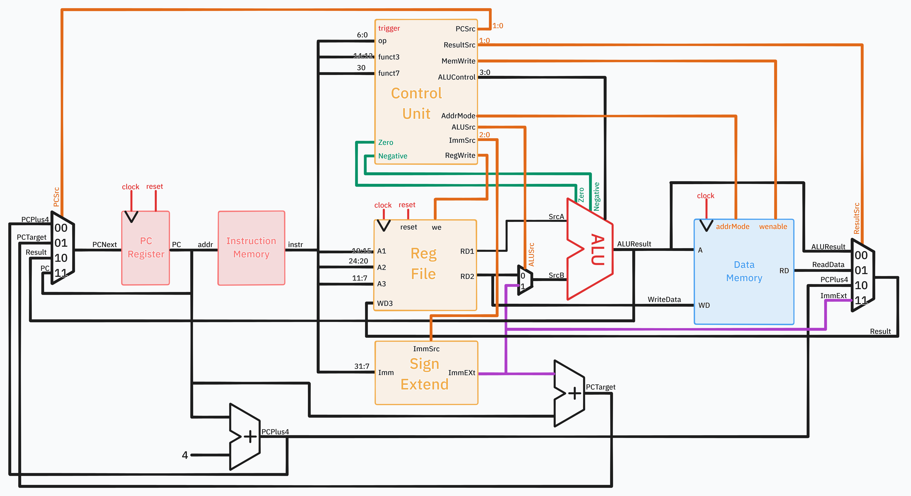

## Table of contents:

- Single Cycle CPU Implementation
- Pipelined CPU Implementation
- Cached Implementation
- Complete RISC-V
- Superscalar Processor
==TODO: Add links==

## Quick Start

We completed the Single-Cycle and all of the stretch goals (Pipelined, Cache, Full RV32I Design). Further, we also embarked on an extension project in designing a dual-ALU superscalar processor. They can be found in the following branches:
| Branch | Description |
| ------ | ----------- |
|`main` | Single-Cycle Implementation |
|`pipelined` | Pipelined Implementation |
|`cache` | Cache + Single-Cycle Implementation |
|`complete` | Pipelined + Cache + Full RV32I Implementation |
|`superscalar` | Superscalar Implementation |

<br>

The following instructions are accurate for all versions of our implementation, execpt for `superscalar`. Specific instructions on testing it can be found within the `superscalar` branch itself.

To access each version,
```bash
git checkout <branch-name>
```

#### Quick Start - GTest Testing

To run the provided tests within the target branch,
```bash
 cd ./tb
 ./doit.sh
```

To run the tests we wrote for individual components (while in `./tb/`),
```
./run_our_tests.sh
```

The script above runs all of our tests. However, the individual C++ testbenches can be found in `./tb/our_tests` and are written with GTest. The scripts to run them are found in `./tb/bash`, where they are named similarly.

#### Quick Start - Vbuddy Tests

##### **Windows only**: remember to include `~/Documents/iac/lab0-devtools/tools/attach_usb.sh` command to connect Vbuddy.

To run the f1 light test within the `./tb/` folder,

```bash
sudo chmod +x f1_test.sh
./f1_test.sh
```

Other versions can omit the usb attachment step.

To run the pdf test wtihin the `./tb/` folder,
```bash
sudo chmod +x pdf_test.sh
./pdf_test.sh
```

Both `cpp` scripts can be found in `./tb/vbuddy_test`. The distribution for the pdf test can be changed by overwriting the distribution name in `./tb/vbuddy_test/pdf_tb.cpp` in line 13.
```cpp
// can change to "noisy" or "triangle"
const std::string distribution = "gaussian"; 
```

## Repository Structure
 ==TODO: Add the repo tree with branches==

### Top Level Contributions

| Section               | Clarke | Joel | Kevin | Partha |
| --------------------- | ------ | ---- | ----- | ------ |
| Single cycle          |        |      |       |        |
| Pipelining            |        |      |       |        |
| Cache                 |        |      |       |        |
| Integration           |        |      |       |        |
| Superscalar Processor |        |      |       |        |

## Team members and Statements:

| Team Member     | GitHub                                                | CID      | Email           | Link to Personal Statement                     |
| --------------- | ----------------------------------------------------- | -------- | --------------- | ---------------------------------------------- |
| Clarke Chong    | [clarkechong](https://github.com/clarkechong)         | 02395382 | cc1823@ic.ac.uk | [Clarke's Statement](statements/ClarkeChong.md)   |
| Joel Ng         | [energy-in-joles](https://github.com/energy-in-joles) | 0219309  | zjn22@ic.ac.uk  | [Joel's Statement](statements/JoelNg.md)          |
| Kevin Aubeeluck | [Kevinaubeeluck](https://github.com/Kevinaubeeluck)   |          |                 | [Kevin's Statement](statements/KevinAubeeluck.md) |
| Partha Khanna   | [parthak314](https://github.com/parthak314)           | 02374670 | pk1223@ic.ac.uk | [Partha's Statement](statements/ParthaKhanna.md)  |

## Single Cycle

### Schematic




### Overview
This single cycle implementation covers the basic requirements for most CPU operations, this implements the following instructions: `R-type`, `I-type (immediate)`, `lbu`, `sb`, `beq`, `bne`, `jal`, `jalr`, `lui`.

### Contributions

| Module                       | Clarke | Joel | Kevin | Partha |
| ---------------------------- | ------ | ---- | ----- | ------ |
| alu                          |        |      |       |        |
| instr_mem                    |        |      |       |        |
| pc_register                  |        |      |       |        |
| datamem                      |        |      |       |        |
| control                      |        |      |       |        |
| reg_file                     |        |      |       |        |
| signextend                   |        |      |       |        |
| top (system integration)     |        |      |       |        |
| F1 Assembly.s                |        |      |       |        |
| System Testing and Debugging |        |      |       |        |
`X` - Lead Contributor   `*` - Partial Contributor

### Pipelined CPU


Fetch - Joel \
Data - Partha\
Execute - Clarke\
Memory - Kevin

Key: * = Created ** = Edited

| Task | Files| Clarke | Partha | Joel | Kevin |
| ---- | ---- | ---- | ---- | ---- | ---- |
| <u>**Single cycle** | ---- | ---- | ---- | ---- | ---- |
| Fetch | instr_mem.sv,<br>pc_register.sv,<br>adder.sv,<br>mux.sv,<br>  | ---- | ---- | ---- | ---- |
| Data | control.sv,<br>reg_file,<br>signextend.sv | ---- | ---- | ---- | ---- |
| Execute | alu.sv,<br>mux.sv | ---- | ---- | ---- | ---- |
| Memory/Write | datamem.sv,<br>mux_4x2.sv  | ---- | ---- | ---- | ---- |
| Integration | top.sv,<br>sim_execute.cpp | ---- | ---- | ---- | ---- |
| <u>**Pipelining** | ---- | ---- | ---- | ---- | ---- |
| <u>**Cache** | ---- | ---- | ---- | ---- | ---- |
| Git | ---- | ---- | ---- | ---- | ---- |


## Joint Statement of Contribution


Below we have tasks at a glance
#### Clarke: 

Tasks:
- Task 1 
	- Explanation
- Task 2 
	- Explanation

#### Partha: 

Tasks:
- Task 1 
	- Explanation
- Task 2 
	- Explanation

#### Joel: 

Tasks:
- Task 1 
	- Explanation
- Task 2 
	- Explanation

#### Kevin: 

Tasks:
- Task 1 
	- Explanation
- Task 2 
	- Explanation


## Project Goalposts 

## Goal 1: Single-Cycle RV321 implentation of F1 lights 
## Stretch Goal 1: Pipelined RV321 Design

### Actions:
- Pipeline Stages
    - Pipeling registers
- Hazard detection Unit
    - Data Hazards
    - Control Hazards
        - Stall pipeling if data required is unavailable
        - Issue Nops or flush instructions for control hazards
        - Decide if forwarding/bypassing is possible
- Forwarding Logic
    - Multiplexers for input to ALU
    - Implement forwarding paths that verify:
         - if destination register of an earlier instruction matches source register of current ins
         - If data is available in memory/writeback, forward it to execute
    - Add forwarding control logic to determine source of operands (reg file or forwarded data)
- Stalling
    - Hold instructions in fetch and decode stages if data is unavailable
    - freeze updates in pipeline registers for affected stages
    e.g. lw followed by dependant instr
- branch handling
    - control hazards:
        - flush pipeline stages when a branch is taken
        - *branch prediction here*
- contrrol signal pipelining
    - ensure all control signals are pipelined.


### Implementation:
- Pipeline Registers between all stages
    - storing instruction data, intermediate data, control signals
- control unit
    - generate pipelined control signals
    - hazard detection and forwarding controls, data dependencies and when to forward or stall
- Hazard detection unit
    - compare source reg of current instr in decode with destination reg in execute, mem and writeback
    - stall/forward signals as needed
- Multiplexers for forwarding
    - at ALU inputs to choose between reg file vs forwarded data from Execute/memory or memory/writeback pipeline reg
- Flushing
    - if a branch is taken, clear instr in pipeline that have not been executed -> replace with nop

## Stretch Goal 2: Adding Data Memory Cache


   
## Stretch Goal 3: Full RV32I Design

## Superscalar Model Implementation

### Hardware
Structural design modifications:
- <span style="color:#eaa19f">Fetch</span>: No change from previous model, output is now `dataA` and `dataB` - selecting consecutive instructions from the Out-Of-Order Processor.
- <span style="color:#e9b76e">Decode</span>: Doubled inputs for each block
- <span style="color:red">Execute</span>: Replicated models for ALU
- <span style="color:#a9caf2">Writeback</span>: Doubled inputs for Data Memory with Load store separate to the data memory to reflect changes in the pipelining section. This is the load store parsing unit. A separate mux for `ResultSrc`. 
Given the time available, this model implements the instructions for `R-type`, `I-type (imm)`

### Out-of-order Processor
The key change here is the Out-Of-Order Processor which is a C++ script (and a Python script that our team originally wrote in). It is compiled and run right before `assemble.sh` in the `doit.sh` script to optimise the assembly for the superscalar processor.
The High level requirements for this file are to:
- Create a dependency graph of all instructions by checking if linking each instruction with preceding instructions based on register data dependencies.
- Create a priority queue based on the number of dependencies that each instruction has.
- Reorganise the instructions based on which has the highest priority (most dependencies), while ensuring no dependency requirement is violated.
- Reassemble this into a new assembly file that is ready to be converted to machine code with `assembly.sh`.
This then follows the same procedure to assemble the instruction set (by `assemble.sh` via the `riscv gnu toolchain`) before inputting this into instruction memory, as shown above.

Further details can be seen in individual reports (Partha, Joel).
