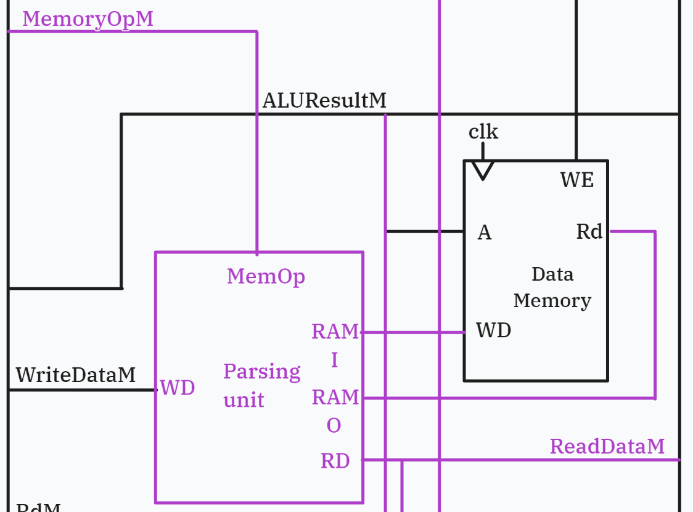

# **RISC-V RV32I Processor Coursework**
#### *Clarke Chong | CID: 02395382 | GitHub: clarkechong*
# Personal Statement</p>

### <p style="font-size:25px">Overview of Contributions</p>

### **Reduced RISC-V (Lab 4)**
- Fetch Stage
    - Program Counter (PC) Register
    - Related Adders
- General Debugging

### **Single Cycle**
- Execute Stage
    - ALU
    - PCTarget Adder

### **Pipelined + Full RV32I**
- Execute Stage
    - ALU + PCTarget Adder + Execute Pipeline Register
    - Branch Logic Module
    - Handle `upper` type and `jalr` instructions
- Hazard unit
    - Implement logic for data forwarding and flushing
- Load / Store Parsing unit
    - Parse RAM read/write data for `byte` or `half` instructions
- Full integration, testing and debugging of pipelined processor
    - Integrate top level fetch, decode, execute, memory and write-back stages
    - Addition of multiplexer to handle data forwarding source in memory stage
    - Implement `trigger` and `rst` inputs

### **Pipelined + Full RV32I + Cache**
- Integration, testing and debugging of pipelined + cached processor
    - Integrate cache module into memory-write stage
    - Modify implementation of load / store parse unit to comply with cache interface

---

### <p style="font-size:25px">Reduced RISC-V (Lab 4)</p>

This marks the beginning of my practical, hands-on learning of RISC-V architecture. By this point, I was confident with SystemVerilog's syntax and the general principles of describing hardware with HDL.

### Fetch stage

For lab 4, I wrote the fetch stage. This consisted of the `PC` register, `PC+4` adder, and `PC+ImmOp` (later known as `PCTarget`) adder. The schematic provided in the lab 4 repository was used as the basis for implementation.


> *Fetch section of the provided lab 4 schematic.*

Points of interest at this time were as follows:
- **`+4` is used to increment the the PC when there is no branch/jump occuring because:**
    - RISC-V instruction ROM (and data RAM) stores 1 byte at each address.
    - As RV32I is a 32-bit architecture, each instruction word is constructed from 4 bytes (hence 4 addresses) in memory.
    - Therefore, the beginning of the next instruction word is fetched 4 ROM addresses from the last.
- **`PCsrc` determines if a branch/jump is executing. Here, it is a flag generated by the control unit.**
    - If `PCsrc = 0`, no branch/jump executes and the next instruction is fetched sequentially from `PC+4`
    - If `PCsrc = 1` there is a branch/jump executing, and the next instruction is fetched from `PC+ImmOp`
- **The `PC+ImmOp` adder may also effectively be performing subtraction.**
    - Many branch/jump instructions require the PC to jump backwards in instruction memory. For example, the `RET` (pseudo) instruction typically jumps to a previous address.
    - Signed extension of `ImmOp` is handled by the sign extension unit before being passed to the `PC+ImmOp` adder.
    - SytemVerilog handles signed arithmetic within the `+` operator, so no extra logic is required regarding this.


Testing the top-level PC module with different input values and `std::cout` statements was sufficient to determine correct working order.

### General Debugging

After integration of the reduced RISC-V processor I debugged many of the ensuing errors, most of which were trivial syntax errors or mismatched interface variables between top-level modules. \
However, together with the team, we found that our branch/jump instructions were behaving unexpectedly - specifically, they were jumping by half of the expected value. \
We recalled that an offset bit 0 is applied to the immediate for branch/jump type instructions, and after ammending this in the sign extension unit, the lab 4 reduced RISC-V processor passed the provided testbench.

---

### <p style="font-size:25px">Single Cycle</p>

Going from lab 4 to single cycle, I decided to branch out to the execute stage.
The design structure remained similar to lab 4 with exception of the `PC+IMM` adder (aka `PCTarget`) which was simply brought forwards into the execute stage. This is in line with the single cycle schematic we designed with.

### ALU

The majority of the work in the execute stage involved expanding the ALU to support additional arithmetic instructions. In the Lab 4 reduced RISC-V version, only the `ADD` instruction was implemented. For improved readability and clarity, I declared the operations and their corresponding `ALUControl` values using a `typedef enum`:

```sv
typedef enum logic [3:0] {
    ADD  = 4'b0000,
    SUB  = 4'b0001,
    AND  = 4'b0010,
    OR   = 4'b0011,
    XOR  = 4'b0100,
    SLL  = 4'b0101, // Shift left logical
    SRL  = 4'b0110, // Shift right logical
    SRA  = 4'b0111, // Shift right arithmetic (signed, MSB extended)
    SLT  = 4'b1000, // Set less than
    SLTU = 4'b1001  // Set less than unsigned (zero-extended)
} control_operation;

...

    input control_operation ALUControl,
```

I decided with Parth, who was working on the control unit, to define `ALUControl` as a 4-bit value, anticipating that we would eventually implement all arithmetic instructions. A 4-bit width is the minimum required to capture the full set of instructions.

Implementing these instructions was straightforward since SystemVerilog provides built-in operators for all of them, except for the `SLT` and `SLTU` (set less than, signed/unsigned) instructions. For these, we perform signed and unsigned comparisons of the ALU operands respectively.

```sv
    always_comb begin
        case (ALUControl)
            ADD:    ALUResult = SrcA + SrcB;
            SUB:    ALUResult = SrcA - SrcB;
            AND:    ALUResult = SrcA & SrcB;
            OR:     ALUResult = SrcA | SrcB;
            XOR:    ALUResult = SrcA ^ SrcB;
            SLL:    ALUResult = SrcA << SrcB;
            SRL:    ALUResult = SrcA >> SrcB;
            SRA:    ALUResult = SrcA >>> SrcB;
            SLT:    ALUResult = (SrcA < SrcB) ? {31'b0, 1'b1} : 32'b0;
            SLTU:   ALUResult = ($signed(SrcA) < $signed(SrcB)) ? {31'b0, 1'b1} : 32'b0;

            default: ALUResult = 0;
        endcase
    end
```

### Testing the ALU

I wrote the testbench `verify_exe_top.cpp` to verify correct operation of the ALU. Relevant code shown in the snippet below:

```cpp
void verifyALU( uint8_t ALUSrc,
                uint8_t ALUControl, 
                uint32_t RD1, 
                uint32_t RD2,
                uint32_t expected_result)
{
top->ALUSrcE = ALUSrc;
top->ALUControlE = ALUControl;
top->RD1E = RD1;
top->RD2E = RD2;
runSimulation();
EXPECT_EQ(top->ALUResultM, expected_result) << "Failed for ALU control: " << std::bitset<3>(ALUControl);
}

...

TEST_F(TestDut, testALU)
{
    verifyALU(0, 0b0000, 62, 97, 62+97); // ADD
    verifyALU(0, 0b0001, 45, 87, 45-87); // SUB
    verifyALU(0, 0b0010, 0b1111'0000, 0b1010'1010, 0b1010'0000); // AND
    verifyALU(0, 0b0011, 0b1111'0000, 0b1010'1010, 0b1111'1010); // OR
    verifyALU(0, 0b0100, 0b1111'0000, 0b1010'1010, 0b0101'1010); // XOR

    top->ImmExtE = 0b1101'0100; // decimal 212

    verifyALU(1, 0b0000, 69, 0, 69+212); // ADD IMM
    verifyALU(1, 0b0001, 69, 0, 69-212); // SUB IMM
    verifyALU(1, 0b0010, 0b1111'0000, 0, 0b1101'0000); // AND IMM
    verifyALU(1, 0b0011, 0b1111'0000, 0, 0b1111'0100); // OR IMM
    verifyALU(1, 0b0100, 0b1111'0000, 0, 0b0010'0100); // XOR IMM
}
```
> *Note that `ALUSrc` determines whether the second operand entering the ALU is taken as the register-read-2 value, or signed immediate, i.e. whether the instruction is register-type or immediate-type. It is generated by the control unit.*

The `verifyALU` function allows for quick, readable initialization of the inputs and expected output value. The ALU passes the test successfully.

---

### <p style="font-size:25px">Pipelined + Full RV32I</p>

### Execute stage: ALU, `PCTarget` adder & pipeline register

The execute stage underwent significant changes transitioning from single cycle to pipelined + RV32I. Whilst the existing modules themselves (ALU and `PCTarget` adder) remained largely unchanged, the logic controlling their input paths was reworked significantly.

One clear change is the separation of stages by pipeline registers, which requires carrying control unit flags across different stages. As a result, the execute stage, which directly follows the decode stage, receives nearly all control of the unit flags - either for immediate use within the execute stage or for passing along to the memory-write stage.


> *Control signals carried across pipeline stages. Notice all but `ImmSrcD` are carried through to the execute stage.*

Note that the pipeline register for each stage is positioned on the output side, connecting that stage to the next. The execute stage pipeline register that I wrote connects the execute stage to the memory stage. 

### Branch Logic Unit and `PCSrc`

I wrote the branch logic module which determines whether a branch instruction will jump or not. It is contained within the execute section because that is the earliest stage at which the branching conditions can be calculated, using the appropriate ALU flags. Note that I added the negative flag to the ALU for this purpose.

Again using a `typedef enum` for readability, I declared the branch operations and their corresponding `Branch` flag values:

```sv
typedef enum logic [2:0] {
    NONE    = 3'b000,
    BEQ     = 3'b001,
    BNE     = 3'b010,
    BLT     = 3'b011,
    BGE     = 3'b100,
    BLTU    = 3'b101,
    BGEU    = 3'b110
} branch_operation;

...

 case(Branch)
    NONE:   PCSrc = 0;
    BEQ:    PCSrc = Zero;
    BNE:    PCSrc = ~Zero;
    BLT:    PCSrc = Negative;
    BGE:    PCSrc = ~Negative;

    default: PCSrc = 0;
endcase

PCSrc = PCSrc | (Jump != 2'b00);
```
> *The line `PCSrc = PCSrc | (Jump != 2'b00)` ensures that jump-type instructions (indicated by non-zero `Jump` flag value) jump unconditionally.*

It is critical to address the differences in implementation between single cycle and pipelined regarding branch/jump calculation and `PCSrc`, and why I chose to implement them differently:
- **Single cycle generates `PCSrc` from the control unit.**
    - Possible with single cycle because the ALU flags are available in the same clock cycle. 
    - Not possible in pipelined because the ALU flags, generated in the execute stage, are no longer available to the control unit at the time of decoding. They are only available by the next clock cycle.
- **`PCSrc` reverted to 1-bit when previously 2-bit in single cycle.**
    - In single cycle, the 4th option was for stalling (`PC = PC`) for `trigger`, but in pipelining this is implemented differently via enable lines for each register.
    - More importantly, the 3rd option was used for `PC = Result (= RD1 + IMM)` (for `JALR`). Possible because `Result` is available in the same cycle, in time for the next fetch.
    - However with pipelining, `ResultW` is not available until the write-back stage, i.e. another 3 clock cycles away, so `JALR` would require flushing the following 3 instructions. 
    - The other two options `PC+4` and `PC+IMM` (for `JAL`) are available much earlier. `PC+4` is in fact already calculated in the fetch stage, and `PC+IMM` (aka `PCTargetE`) is available during the execute stage.
    - The solution to this was capturing `PC = RD1 + IMM` within the calculation of `PCTargetE` in the execute stage. 
    - Hence `PCSrc` only requires 1 bit: `0` for selecting `PC+4` and `1` for selecting `PCTarget`.

Understanding this, we can appreciate why the `PCTarget` adder was brought into the execute stage. It allows `PCSrc` and `PCTarget`, which require each other to work, to be calculated and sent back to the fetch stage at the same time.

I had also considered moving both branch logic and the `PCTarget` adder forwards into the decode stage to further reduce the cycle delay in calculating branches, however we decided as a team against this. We felt it would misrepresent an accurate RISC-V processor, where evaluating branch conditions within the decode section would add significant hardware costs.

### Control Paths for `JALR` and Upper-type Instructions

As explained above, new logic was required to implement `JALR` within the existing `PCTarget` adder. The design for this is relatively straightforward:

The 2-bit `Jump` flag controls a multiplexer to choose operand 1 of the adder as `PC` or `RD1`.
- If `Jump = 2'b10` (`JALR` flag value), then `PCTargetE` calculated as `RD1 + IMM`.
- Otherwise, calculate `PCTarget` as `PC+IMM`.

Initially I chose to have a separate `JALR` flag, but later moved it into the `Jump` flag to reduce number of control signals being passed.


> *See that all possible `PC` values can now be correctly assigned: `PC+4`, `PC+IMM` and `RD1 + IMM` (here, `RD1` same as `rs1`)*

For upper-type instructions, I used a similar multiplexer to choose `srcA` of the ALU between `RD1` (non-upper instruction), `0` (`LUI`) and `PC` (`AUIPC`). At this point, Parth helped me out by generating a new flag `UpperOp` from the control unit.

| UpperOp | Instruction                     |
|---------|---------------------------------|
| 00      | Non-upper                       |
| 01      | `LUI: RD = IMM << 12`           |
| 10      | `AUIPC: RD = PC + (IMM << 12)`  |

Note that `ALUSrc = 1` for upper instructions such that ALU `srcB = IMM`.

```sv
mux3 upper_operation_mux (
    .in0(RD1_Wire),
    .in1(0),
    .in2(PCE),
    .sel(UpperOpE),
    .out(ALU_SrcA_Wire)
);

...

mux mux_jalr (
    .in0(PCE),
    .in1(RD1_Wire),
    .sel(JumpE == 2'b10),
    .out(PCAdder_SrcA_Wire)
);
```
> *Both multiplexers located in **execute_top.sv***


> *Overview of new control paths: green for upper-type, red for `JALR`*

### Hazard Unit
Written in collaboration with Kevin, the hazard unit was implemented to resolve data hazards by forwarding values from the memory or write-back stages. If a register value in the execute stage is due to be written back to (i.e. address of register value matches destination register `Rd` in memory or write-back stage and `RegWrite M/W = 1` ), then the data from the corresponding section is forwarded. \
Note that the hazard unit only needs to generate the multiplexer select signals to choose from which stage to forward if any. The actual data wires connect directly from the memory/write-back stage to the execute stage.


> *Our hazard unit closely resembles this schematic. However, this schematic lacks control for selecting the correct data source to forward from the memory stage. See debugging section of full integration regarding this.*

Typically, the hazard unit may be expected to handle flushes and stalls of the pipeline when control hazards occur. Our implementation is not required to handle these because:
- Forwarding data has removed the need for stalls due to data hazards.
- Flushing due to a branch/jump control hazard is handled separately using `PCSrc` in the decode stage.
    - If `PCSrc = 1` at any point, it indicates a branch/jump is executing.
    - This deems the previous instruction, which will have been fetched from `PC+4`, invalid.
    - This incorrect instruction resides in the decode stage when `PCSrc` becomes 1. It enters the decode pipeline register in the next cycle.
    - Hence, clearing (flushing) the decode pipeline register on the next `negedge clk` when `PCSrc = 1` will remove this incorrect instruction from the pipeline entirely.
- Rerouting flush functionality (and hence `PCSrc`) through the hazard unit is possible but unnecessary as `PCSrc` is already an output signal from the execute stage.

As such, the core forwarding logic of the hazard unit is shown below.

```sv
always_comb begin
    if ( (Rs1E == RdM) & RegWriteM )        ForwardAE = 2'b10;
    else if ( (Rs1E == RdW) & RegWriteW )   ForwardAE = 2'b01;
    else                                    ForwardAE = 2'b00;

    if ( (Rs2E == RdM) & RegWriteM )        ForwardBE = 2'b10;
    else if ( (Rs2E == RdW) & RegWriteW )   ForwardBE = 2'b01;
    else                                    ForwardBE = 2'b00;
end
```
> *`ForwardAE` and `ForwardBE` drive the multiplexers that chose the stage from which to forward data, if any.*

### Load/Store Parsing Unit

The load/store parse unit is required to implement `load` and `store` instructions of address type `byte` or `half`. I wrote and integrated it within the memory stage to interface with the data RAM module.


> *Parse unit interfacing with RAM module. `ReadDataM` is the final read data and is carried into the pipeline.*

In order to determine the type of parsing operation being performed, a new control unit flag `MemoryOp` was introduced by Partha. Once again, I declared a `typedef enum` with the flag value of each memory operation:

```SytemVerilog
typedef enum logic [2:0] {
    BYTE            = 3'b000,
    HALF            = 3'b001,
    WORD            = 3'b010,
    BYTE_UNSIGNED   = 3'b011,
    HALF_UNSIGNED   = 3'b100
} memory_operation;
```
> *Note that `store` instructions do not utilize the unsigned-type variants.*

The actual implementation is not too complicated:
- `load` instructions parse the 32-bit word read from RAM:
    - `LB` takes bits `[7:0]` and sign extends the MSB (bit 7). The unsigned variant `LBU` simply extends to 32-bit with zeros.
    - `LH` takes bits `[15:0]` and sign extends the MSB (bit 15). Again, the unsigned variant `LHU` extends to 32-bit with zeros.
    - `LW` takes the full word into the output, `ResultDataM`
- `store` instructions parse `WriteData` before storing into memory. Bits that are not written to retain their original values before the store operation.
    ```sv
    // STORE logic, drives RAM_In
    case(MemoryOp)
        BYTE:  RAM_In    = {RAM_Out[31:8], WriteData[7:0]};      // if storing byte, keep bits 13:8 unchanged
        HALF:  RAM_In    = {RAM_Out[31:16], WriteData[15:0]};    // if storing half, keep bits 31:16 unchanged
        WORD:  RAM_In    = WriteData[31:0];
        
        default: RAM_In = RAM_Out;
    endcase
    ```

I later realized that this implementation assumes unaligned memory access, meaning that it treats accesses to non-multiple-of-4 addresses as valid. This approach is generally not appropriate for RISC-V architecture. 

This is indicated by the lack of an offset to determine which byte or half is being operated on - it always writes or stores to the first 8 or 16 bits of the word.
- E.g. if accessing address 0x3, the implementation assumes the word is fetched from 0x3, 0x4, 0x5, and 0x6 (unaligned access). 
- In contrast, aligned access would require fetching the word starting from 0x0 to 0x4, then selecting the correct byte or half using an offset.

As such, this implementation was later modified during integration of pipelined and cache to ensure compatibility with the word-aligned cache.

### Full integration, testing and debugging

Once everyone completed the pipelined version of their sections, and after finishing the hazard unit and parsing unit, I took charge of integrating the top-level modules. Initial integration was generally smooth as we had each communicated to each other our implementations and input/output interfaces during development.

I created a folder `simple-tb/` with a script `check-syntax.sh` which batch checks modules for syntax and compilation errors. I also updated the `doit.sh` script to run with our rtl/ folder structure divided into section folders (i.e. fetch/, decode/, execute/, etc.).

```bash
find ../rtl -type f -name "*.sv" > filelist.f

...

verilator ... -f filelist.f
```
> *Previously, `-y ../rtl` was used to include all modules in the include path, however the `-y` (include path) flag is unable to access subfolders within `rtl`. Now, `filelist.f` contains all `.sv` files within `rtl`'s folder structure*

After a short initial phase of debugging, I was able to get most tests from the provided testbench to pass. The main hurdles were debugging the `lbu_sb.s` and `pdf.s` tests.

After further debugging in GTKWave, I identified the issue to be an error with forwarding. After reviewing the schematic we were designing with, I noticed that forwarding from the memory stage always assumed the data source was `ALUResultM`. It overlooks cases where the source could be `ReadDataM` or `PC+4` (such as `lb` data hazard, or `JAL` data hazard with storing `PC+4`).

Therefore, I implemented control logic for selecting the correct data source when forwarding from the memory stage. It is essentially the `ResultSrcW` write-back multiplexer but copied into the memory stage. With this, the correct data source is now forwarded the memory stage instead of always defaulting to `ALUResultM`.

Finally, after passing the `lbu_sb.s` and `pdf.s` tests, I implemented the trigger and reset top-level inputs by adding enable and clear functions to all registers. This follows from the fact that the state of a processor can be described entirely by the state of its registers.
- By clearing all register values we effectively reset the processor state (reset function).
- By pausing all register values (i.e. disable writing to the registers) we effectively pause the whole processor (trigger function).

---

### <p style="font-size:25px">Pipelined + Full RV32I + Cache</p>

### Integration

Joel and Parth implemented a 2-way set associative cache with 512 cache lines. Their cache was written in the single cycle version, so I took charge of integrating it into the pipelined + RV32I version.

Initial integration was relatively straightforward, as the cache just augments the existing data RAM module. The difficulty arose when trying to interface it with the load/store parsing unit. Note that the cache was already implemented with byte-address-type parsing, but we still decided to integrate it with the parsing unit for these reasons:
- The single cycle version is not full RV32I. Variants of the `LB` instruction (`LBU`, `LH`, `LHU`) and `SH` are not implemented, hence the single cycle cache lacked the parsing capability for these instructions.
- We wanted to separate the parsing logic from the cache itself for modularity and consistency with the rest of the design.

As mentioned briefly already, the unaligned-access parsing unit conflicted with the aligned-access cache. This is because the cache works with blocks of 4 bytes, and it is not possible to read one word across 2 different cache lines. This was solved by the following thought process:
- Parsing unit can no longer assume first 8 or 16 bits are being operated on.
- It now receives a block of 4 bytes but the first byte is aligned to a multiple-of-4 address.
- So, a byte offset is required to select the desired byte (or half) to operate on.
    - E.g. if operating on a byte at `0x3`, then the block `0x0` to `0x4` is retrieved. The byte offset to select the byte at `0x3` would be `0b10`.
    - `00` for 1st byte, `01` for 2nd, `10` for 3rd, `11` for 4th
- Take this byte offset variable from the cache module. It corresponds to bits [1:0] of the RAM address being accessed (in other words, bits `[1:0]` of `ALUResultM`).
- Now we know which byte/half to operate on. Resume regular parsing operation.
    - Sign/unsigned extension of byte or half for `LB` and `LH`.
    - For store instructions, ensure only the desired byte/half is overwritten. The remaining bits should maintain the same value as when the block was retrieved.
- Remember that `LW` and `SW` require no parsing or sign extension.

```sv
input logic [1:0] ByteOffset,

...

// LOAD logic
case(MemoryOp)
    WORD:           ReadData    = MemReadOutData[31:0];

    BYTE:           ReadData    = {{24'b0}, MemReadOutData[ByteOffset*8 +: 8]};     // sign extended below
    HALF:           ReadData    = {{16'b0}, MemReadOutData[ByteOffset*8 +: 16]};    // ^^^
    BYTE_UNSIGNED:  ReadData    = {{24'b0}, MemReadOutData[ByteOffset*8 +: 8]};     // unsigned so zero extended
    HALF_UNSIGNED:  ReadData    = {{16'b0}, MemReadOutData[ByteOffset*8 +: 16]};    // ^^^
    
    default: ReadData = MemReadOutData;
endcase

if (MemoryOp == BYTE) ReadData[31:8] = {24{ReadData[7]}};   // byte is sign extended for lb
if (MemoryOp == HALF) ReadData[31:16] = {16{ReadData[15]}};  // half-word is sign extend for lh
```
> *The expression `[ByteOffset*8 +: 8]` selects the desired byte using the `+:` dynamic bit selection operator. E.G. if `ByteOffset = 2`, then the next 8 bits from bit 16 are selected (byte `[23:16]`)*

One final point: the `ByteOffset` for half-type instructions is assumed to be a multiple of 2. If operating on the upper half of the block, then `ByteOffset` would be `0b10`, and for the lower half, `0b00`.

---

### <p style="font-size:25px">Conclusion & final thoughts</p>

People always say the best way to learn is to apply your knowledge in practice. For myself, this project has been one of the best examples of this. I now feel confident in explaining each stage of a pipelined processor with cache, and even some of the nuances of associated with a RISC-V processor. Several personal statements from previous groups mention that they wished they had branched out across different sections of the project - I listened to this and did so from the start and I am thoroughly glad I did so.

I am also incredibly fortunate to have worked with such a strong team. Everybody was proactive and communicated their ideas and criticism well. I look forwards to being able to work with them again in future.