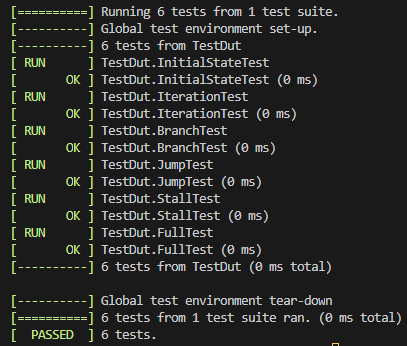
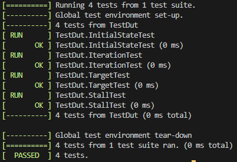
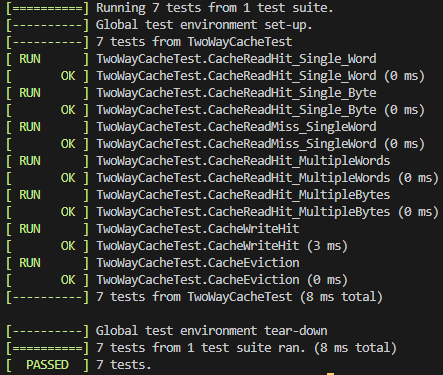
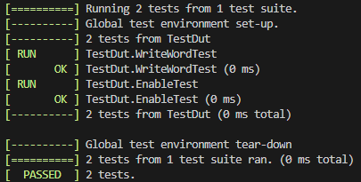
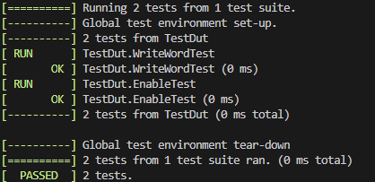

# Joel Ng's Personal Statement
#### CID: 02193809, Github username: energy-in-joles

---

## Summary of contributions (in chronological order):

### [Single-Cycle](#single-cycle-1)
1. [Created Fetch module and testbenches](#created-fetch-module-and-testbenches)
2. [Integrated single-cycle system and debugged system to pass testbenches](#integrated-single-cycle-system-and-debugged-system-to-pass-testbenches)
3. [Co-wrote the testbench scripts for f1_fsm with Kevin and wrote the testbench script for Vbuddy PDF](#co-wrote-the-testbench-scripts-for-f1_fsm-with-kevin-and-wrote-the-testbench-script-for-vbuddy-pdf)

### [Pipelined](#pipelined-1)
1. [Modified Fetch module and testbenches for pipelining](#modified-fetch-module-and-testbenches-for-pipelining)

### [Cache (Single-Cycle)](#cache)
1. [Design and implement two-way write-back cache implementation](#design-and-implement-two-way-write-back-cache-implementation)
2. [Assisted in writing testbenches for cache system](#assisted-in-writing-testbenches-for-cache-system)
3. [Completed integration of cache with single-cycle system](#completed-integration-of-cache-with-single-cycle-system)

### [Pipelined + Cache (Final Version)](#complete-pipelined--cache)
1. [Implemented pipelining stall for cache miss](#implemented-pipelining-stall-for-cache-miss)

### [Extension: Superscalar Processor](#extension-superscalar-processor-super-calculator)
1. [Designed out-of-order assembly execution script with Partha](#designed-out-of-order-assembly-execution-script-with-partha)
2. [Integrated compiler script with superscalar processor and debugged](#integrated-compiler-script-with-superscalar-processor-and-debugged)

### [Conclusion](#conclusion-1)

---

## Single-Cycle

### Created Fetch module and testbenches

For the single-cycle part of the project, we worked in our individual branches, where I did most of the writing and testing in the `fetch` branch. Using Clarke's fetch module that he created for the RISC-V reduced processor, I tweaked the module design to fit within the full single-cycle processor. 

To test the functionality of the module, I wrote a comprehensive testbench script `./tb/our_tests/fetch_top_tb.cpp` with _GTEST_ that can be used with the script `./bash/fetch_top_test.sh`. It tests the functionality of the fetch module thoroughly, where I loaded the instructions in `/reference/pdf.hex` into `instr_mem.sv` and compared results against a ground truth array of the `pdf.hex` instructions. My tests covered the following:
1. **InitialStateTest:** Sanity check to test the instruction at the first position matches with the ground truth array
2. **IterationTest:** Check that the fetch module iterates through the entire `pdf.hex` correctly (with the PC+4 functionality, PCSrc = 0).
3. **BranchTest:** Check that the fetch module branches correctly (using PC + Imm functionality, PCSrc = 1). This was done by feeding the module with a vector of Imm positions to jump forward or backwards and to compare the instruction output with the ground truth array.
4. **JumpTest:** Check that the fetch module jumps to the Result value correctly (Using rs1 + imm for JALR, PCSrc = 2). This was done in a similar fashion to branch, comparing the post-jump instruction with the ground truth array.
5. **StallTest:** Check that the fetch module correctly stalls with PCSrc = 3 (This is implemented to stall with trigger).
6. **FullTest:** Finally, a test that mixes all the previous components to ensure they all work in tandem.



As expected, we receive a full score on the testbench.

### Integrated single-cycle system and debugged system to pass testbenches

After everyone had completed their parts, I led the team in integrating their various components together, double checking that their testbenches were accurate and that they were passing all required tests. I then built the `top.sv` for the single-cycle module and began to connect the various top modules together. As I was putting everything together, there were 3 major issues that we failed to address individually:
1. There was some discrepency in the understanding of LUI and JAL implementation (implicit 0 LSB bit in jump and 12 bit shifting in LUI). This led to the wrong data being sent from the decode block.
2. We had not considered the implementation of JALR properly and were lacking the required hardware to perform PC = rs1 + imm. This was resolved with point 3.
3. We had also not considered the implementation of trigger in the system. We required the ability to stall the system with the trigger input, and this was done by converting PCSrc to be 2 bits long. This accommodated additional cases: PCNext = rs1 + imm (PCSrc = 3) for JALR in point 2, and PCNext = PC (PCSrc = 4) for trigger stall.

With the help of Partha, point 1 and 2 were discovered by debugging the system with GTKWave, where we scrutinised each instruction waveform in the failed `2_li_add` and `4_jal_ret` tests from the `doit.sh`.

For point 3, we also encountered a bug where as the system stalled and instructions were repeated, instructions that involved register or memory write would continually write during the stall. This was an issue for an incremental instruction like `addi a0, a0, 5` because we would be continually adding 5 to `a0` during the stall. This was resolved by disabling write enables during stall to prevent unncessary overwrite.

After these considerations were made, the single-cycle system successfully passed all cases and the final schematic and implementation can be seen in the main [README.md](../README.md#single-cycle).

### Co-wrote the testbench scripts for f1_fsm with Kevin and wrote the testbench script for Vbuddy PDF

#### f1_fsm

While I was debugging the single-cycle system, Kevin wrote a rough outline of the `./tb/vbuddy_test/f1_fsm_tb.cpp` test. I then integrated the assembly that Partha had written in `./tb/asm/f1_fsm.s`, by building a temporary `program.hex` file with shell commands in the testbench cpp script (same as what was done for `doit.sh`). To show off the trigger implementation, I also connected it to the `vbdflag()` feature on Vbuddy, so that we could see the system stopping and sarting with the press of the rotary switch.

#### pdf

For the pdf implementation, I similarly loaded the `reference/pdf.hex` into a temporary `program.hex` file, along with string input for the appropriate distribution (gaussian, noisy, etc.) to load into a `data.hex` file for the RAM module. 

As it was only meaningful to display the waveform once the program was in its `display` loop, I had to come up with a way to discern when it was time to run `vbdplot()` to plot the waveform. Initially, since we knew the program loops forever, I created a long delay of about 1e6 cycles - long enough such that we know that we will definitely be in the `display loop`. However, this implementation seemed clumsy to me. Since we were plotting `a0` and it was only written to during the `display` loop, I decided to set a flag in the cpp that is triggered when the `a0` output differs from the recorded `a0` value at the start of the program.

```cpp
bool displaying = false;
int original_a0 = top->a0; // record the original a0 value. If it changes, means time to display
int j = 0; // vbudy display cycle counter (only starts incrementing when displaying)
```

This worked very effectively!

Another issue I noticed while I was running the program, was that the gaussian signal seemed to be stretched along the horizontal axis. On closer inspection of the code, I realised that this was due to the fact that within the display loop of the assembly code, the output `a0` is only updated every 3 cycles, as the other 2 clock cycles were used for fetching the next value in RAM and for looping:

```s
bfc00060 <_loop3> (File Offset: 0x1060):
_loop3():
bfc00060:	1005c503          	lbu	a0,256(a1) # a0 only updates here!
bfc00064:	00158593          	addi	a1,a1,1
bfc00068:	fec59ce3          	bne	a1,a2,bfc00060 <_loop3> (File Offset: 0x1060)
```

Hence, it was not useful to be plotting on every cycle, where I decided to instead plot every 3 cycles:

```cpp
if (!is_paused) {
    // we only plot every 3 steps because we only update a0 every 3 steps in the loop
    // BNE and ADDI don't make any direct changes to a0.
    j++;
    displaying = true;
    if (j % 3 == 0) {
    vbdCycle(j);
    vbdPlot(top->a0, 0, 255);
    }
}
```

I also added quality of life features such as:
- Displaying the distribution in the display header (so that we can photograph and identify the distributions)
- A simple interrupt listener to remove the temporary hex files when the program is interrupted (as seen below)

```cpp
void end_program(int signum) {
  std::cout << "\nShutting down..." << std::endl;
  std::ignore = system("rm -f program.hex data.hex");
  exit(signum);
};
```

## Pipelined

### Modified Fetch module and testbenches for pipelining

Much of the design considerations and planning for pipelining was done by Clarke and Kevin. I took charge of the fetch section of the processor again, adding a `fetch_pipeline_regfile.sv` to the fetch module. This register was to separate the instructions at the decode stage (denoted with `_o` suffix below) and the next instruction coming out of the fetch stage (denoted with `_i` suffix below):

```sv
always_ff @ (negedge clk) begin

    if (en & !clear) begin // regular operation
        Instr_o     <= Instr_i;
        PC_o        <= PC_i;
        PCPlus4_o   <= PCPlus4_i;    
    end

    else if (clear) begin // if cleared, set all to 0 (useful for flush and reset)
        Instr_o     <= 0;
        PC_o        <= 0;
        PCPlus4_o   <= 0;
    end

end
```

Note that we are writing to the register on the negative clock edge this time. This is to address timing issues, ensurirng that the pipeline register input is pushed to the next stage before the next positive clock edge.

Further, we also abstracted PCSrc back to being 1 bit, where instead of separating JALR (PCNext = rd1 + imm) and branch functions (PCNext = pc + imm), we decided to instead centralise them with a `PCTarget` wire that is updated outside the fetch module. Further, there is a dedicated `stall` wire, since stalling is now a core feature of our system (as part of the way pipelined systems are designed).

After changing the code, I updated my `./tb/our_tests/fetch_tb.cpp` file to include the new `fetch_pipeline_regfile.sv`, split into the following test:
1. **InitialStateTest:** Sanity check, same as above. However, this time we run an extra cycle to push the first instruction to `Instr_o`.
2. **IterationTest:** Test that the processor iterates through instructions correctly, same as before.
3. **TargetTest:** Test that pc goes to the `PCTarget` correctly on the following cycle.
4. **StallTest:** Test that the fetch module correctly stalls when `stall` is HIGH.



### Discussion about trigger stall implementation in pipelining

Although I did not play as big of a role in integrating the pipelining system, I discussed with the team how we could implement the trigger stall in the new system, where we finally came to the consenus of routing trigger to the pipeline registers to "freeze" and maintain the states at each stage by preventing anything being written to the registers during a stall. This worked perfectly!

## Cache

I took the lead role in the design, creation and testing of the cache module. This discussion pertains specifically to our first iteration of cache (within `cache` branch), where we implemented cache on a single cycle system for simplicity. It was later integrated into the pipelined system in the `complete` branch, that will be discussed later.

Initially, Partha proposed a solution with a single cache controller script that implicity held an array to store the cache data. However, I decided to abstract the physical sram memory block into a separate module so that we could better debug the input and output of both modules.

We finally decided on the following system:
```
├── memory_top.sv
│   ├── ram2port.sv
│   ├── two_way_cache_top.sv
│   │   ├── two_way_cache_controller.sv
│   │   └── sram.sv
```

- `memory_top.sv`: No change to the way it interacts with the other external modules. This allows the cache system to be highly modular, as it makes no impact on the rest of the system.
- `ram2port.sv`: As we were working on the cache implementation, we recognised that we required a dual-port RAM, because a cache miss may require both writing to RAM (because of the write-back system), and reading from RAM (retrieving the missed word).
- `two_way_cache_top.sv`: This module was responsible for handling the input and outputs between RAM and the cache system, as well as input and outputs from memory_top.
- `two_way_cache_controller.sv`: This module houses the majority of logic for the cache system. This will be discussed next.
- `sram.sv`: This module just serves as a memory block (similar to the way the ram module is designed).

### Design and implement two-way write-back cache implementation

In this section, we will mostly be discussing the implementation the cache controller and sram. Since we are designing a two-way cache block to hold 4096 bytes (1k words), we are able to determine the number of sets it will store:
```
Number of bytes in word = 4 (8 bits * 4 in one word)
Hence, number of words = 4096 / 4 = 1024

Number of ways in one set = 2
Hence, number of sets = 1024 / 2 = 512.
```

Since we are storing 512 sets, we know that our number of set bits will be **log2(512) = 9**. We can then determine the number of bits in each word tag:

```
Number of address bits = 32 bits
Number of set bits = 9 bits
Byte offset = 2

Hence, number of bits in each tag = 32 - 9 - 2 = 21.
```

This allows us to calculate the total number of bits in one set (including all the overhead bits):
```
Number of LRU bits = 1 (0 = word0 and 1 = word1)
Number of V bits = 2 (1 for each word)
Number of dirty bits = 2 (1 for each word)
Number of tag bits = 42 (21 for each word)
Number of word bits = 64 (32 for each word)

Hence, total bits in a set = 1 + 2 + 2 + 42 + 64 = 111.

-------

Format for each way:
Way{n} = | V bit | dirty bit | 21-bit tag | 32-bit word |

Set format:
| LRU Bit | Way0 (55 bits) | Way1 (55 bits) |
```

#### Cache System Design

Using this, we are able to create our cache system. We retrieve the relevant set from cache, and dissect the set bits into their respective categories: lru_bit, v_bits, dirty_bits, tags, words.

We determine a cache hit as when the v bit of the set way is HIGH and when the tag matches with the input tag:
```sv
assign hits[0] = (v_bits[0] && (tags[0] == target_tag));
assign hits[1] = (v_bits[1] && (tags[1] == target_tag));
```

On a cache miss, most of the logic is straightforward: we use the LRU bit to decide which word to evict and, we replace the evicted way with the correct data from RAM. When design a write-back cache, however, we have to determine when we are required to write back to RAM on eviction. This was determined to be when the v bit of the evicted set is HIGH and when the dirty bit is HIGH. This allows us to ensure that we are writing valid, new data to RAM:

```sv
// ensure that the v_bit belong to the evicted way is HIGH
// ensure that the dirty_bit belong to the evicted way is HIGH
if(v_bits[evicted_way] && dirty_bits[evicted_way]) begin
...
```

We realised that the cache controller must also be responsible for correct byte addressing (LBU and SB), as the RAM block should only be communicating with the cache via word addresses. Hence, the responsibility is shifted to the cache controller. We routed the `addr_mode` wire to the cache_controller to enable us to do byte addressing for load and store within the cache controller.

```sv 
if (we) begin // write to cache
    if (addr_mode) begin
        case (offset) // handle different offsets for SB
            2'b00:      new_words[correct_way] = {new_words[correct_way][31:8], wd[7:0]};
            2'b01:      new_words[correct_way] = {new_words[correct_way][31:16], wd[7:0], new_words[correct_way][7:0]};
            2'b10:      new_words[correct_way] = {new_words[correct_way][31:24], wd[7:0], new_words[correct_way][15:0]};
            2'b11:      new_words[correct_way] = {wd[7:0], new_words[correct_way][23:0]};
            default:    new_words[correct_way] = {new_words[correct_way][31:8], wd[7:0]};
        endcase
    end else new_words[correct_way] = wd;

    new_dirty_bits[correct_way] = 1'b1; // update dirty bit
end

// read from cache address
if (addr_mode) begin
    case (offset) // handle different offset for LBU
        2'b00:          data_out = {24'b0, new_words[correct_way][7:0]};
        2'b01:          data_out = {24'b0, new_words[correct_way][15:8]};
        2'b10:          data_out = {24'b0, new_words[correct_way][23:16]};
        2'b11:          data_out = {24'b0, new_words[correct_way][31:24]};
        default:        data_out = {24'b0, new_words[correct_way][7:0]};
    endcase
end else                data_out = new_words[correct_way];
```

#### Circular Logic Issue

The biggest challenge I faced was the complicated sequential logic that was completed in one cycle. When we encounter a cache miss, there is a long sequence of information to update, including reading and writing back to RAM. When poorly handled, updates along the way could lead to circular logic.


To simplify the process, I created a copy of each set variable (v bit, dirty bit, tag, word) within the `always_comb` block that I updated during the cache retrieval process. This way, I could complete all updates without modifying the original set data. After all logic had been updated, I wrote back to the set block with the updated variables.

### Assisted in writing testbenches for cache system

While I was writing the cache system, Partha helped me write a series of tests for `two_way_cache_top.sv`, testing that our system correctly read via byte/word addressing, and that the write-back feature and RAM data retrieval process was valid during a cache miss.

This test can be found in `cache branch -> ./tb/our_tests/cache_top_tb_p2.cpp` that can be run with the script found in `cache branch -> ./tb/bash/cache_top_test_p2.sh`.

Initially, there were some issues with the testbench, where it expected a synchronous read. However, I worked with him to correct this issue:



We successfully passed all the test cases from his testbench! During debugging, I also wrote a simple testbench script to test the eviction functionality of the system. This can be found in `cache branch -> ./tb/our_tests/cache_top_tb_p1.cpp` that can be run with the script found in `cache branch -> ./tb/bash/cache_top_test_p1.sh`. 

The test cases are as follows:
- **WriteWordTest:** This test worked within a single set, writing words to it and observing that the system attempts to read from ram on cache miss, and that cache data written back to RAM is retrieved correctly.
- **EnableTest:** This test was to ensure that the cache access enable logic was working. On cache disable, it should output `32'b0`. More on the cache access enable design will be discussed in the [next section](#cache-access-enable).



Similarly, we pass the two tests with no issue!

### Completed integration of cache with single-cycle system

The challenge now was integrating our cache system as a submodule in the `memory_top.sv` module. Although we had passed the earlier testbenches, we were having significant issue passing the pdf test in `doit.sh`.

#### RAM Addressing Issue

After meticulously debugging the system with GTKWave, we found a major oversight in our integration. For the cache system to work, it was imperative that we ONLY read and write to our RAM memory block in word aligned offsets (ie in blocks of 4 bytes starting from address 0).

The issue we were facing was that we were reading from RAM directly with the address input in `memory_top.sv`. This includes when we were performing byte addressing, resulting in cache words being retreived wrongly. To address this, we replaced the least 2 significant bits in `r_addr` with `2'b0` to ensure that we always read from RAM in word addressing.

```sv
ram2port ram_mod (
    ...
    .r_addr({ALUResult[31:2], 2'b0}), // always read from ram in 32 bit word blocks (byte addressing handled in cache only)
    ...
);
```

#### Cache Access Enable

Secondly, I also realised that even on instructions that did not involve the memory module, the cache system would still attempt to read from the `memory_top` input of `ALUResult`. This resulted in unncessary cache access that led to cache updates and evictions, even when cache was not involved. To resolve this, I added an enable pin to the `two_way_cache_top` module, where cache would only operate when `en` was HIGH. Else, it would produce an output of `32'b0`.

As this enable pin was relevant to both read and write operations, I added an OR operator in `memory_top` that assigned `CacheAccessEnable` (wire connected to cache `en`) to HIGH on both:

```sv
// assign HIGH when ResultSrc == 2'b01 (ie when trying to read from memory)
// OR when MemWrite (ie when trying to write to memory)
assign CacheAccessEnable = (ResultSrc == 2'b01 || MemWrite);

two_way_cache_top cache_top_mod (
    ...
    .en(CacheAccessEnable),
    ...
);
```

#### RAM Read Enable

Although a RAM read enable pin had no impact on the actual performance of the system in simulation, I thought it illogical for us to be reading from RAM on every cycle. This would defeat the purpose of using a cache system, if we were attempting to read from RAM each time as well. Hence, I added a RAM read enable pin to the system. This was only assigned to HIGH on a cache miss:

```sv
if (hits[0] || hits[1]) correct_way = hits[1]; // if hit
else begin // if miss
    ...
    re_from_ram = 1'b1; // only assign HIGH on miss
    ...
end
```

Finally, it was important to acknowledge an assumption in the simulation that may not hold true in reality. When we are trying to squeeze an entire cache miss operation in one cycle, we have to operate on the assumption that RAM read is instant. That is, when we enable RAM read after a miss, the data is sent to cache immediately.

Naturally, this is unrealistic and is antithetical to the purpose of the cache system. However, for the purpose of this single-cycle system, we have to make this assumption. When we migrate to an integrated cache + pipelined system, we are able to build a more realistic cache miss mechanism that requires a system stall for RAM data retreival. This will be discussed in the next section.

## Complete (Pipelined + Cache)

### Implemented pipelining stall for cache miss

After Clarke had integrated my cache module within his pipelined system, I assisted in debugging the system with GTKWave to ensure that the complete system passed all relevant tests (tests in `doit.sh`, `f1_test` and `pdf_test`).

After everything was working as expected, I challenged myself to add a pipelining stall to the system on cache miss. I was unsatisfied with the idea that our RAM could be accessed immediately on demand, and wanted to make it more realistic.

#### Stalling

To implement this, I made use of the existing stall mechanism that Clarke had integrated into the pipelined version. This system was to allow us to stall the entire system using the `trigger` input. It was achieved by feeding the trigger input into the pipeline register at each stage. This way, each stage would maintain its state during a stall, and would "freeze" in place.

Since we also want to stall with a cache miss, We just needed to change the input to each pipeline register as a `OR(trigger, cache_miss)`. To do this, I exposed a `cache_miss` output from the `memory_top` module, and connected it to an external `stall_top` module (found in `complete branch -> ./rtl/top-module-interfaces/stall_top.sv`) within `top.sv` to output whether or not to stall next cycle.

The `stall_top` module:
```sv
module stall_top (
    input logic         cache_miss,
    input logic         trigger,

    output logic        out
);

    assign out = (trigger || cache_miss); // OR(trigger, cache_miss)

endmodule
```

Within the `top.sv` module:
```sv
module top #(
    parameter DATA_WIDTH = 32
) (
    input logic                     clk,
    input logic                     trigger,
    input logic                     rst,

    output logic [DATA_WIDTH-1:0]   a0
);
    ...
    wire                    Stall_wire;
    ...
    stall_top stall (
        .trigger(trigger),
        .cache_miss(CacheMiss_wire),
        .out(Stall_wire) // feed the stall outcome to all other submodules
    );
    ...
    fetch_top fetch (
        ...
        .stall(Stall_wire), // stall input changed to the output from stall_top
        ...
    );
    ...
    // done the same for decode_top, execute_top, memory_top
```

#### Synchronous RAM read

In order to handle reading from RAM on the miss, it made sense for us to update the read enable of RAM to high on the cycle that we miss. However, this proved to be an issue with an asynchronous version of RAM read, as the output of RAM would update immediately and result in circular logic within the entire system (change from a miss to a hit in cache, resulting in the stall value changing).

This was not realistic, as we are specifically trying to simulate the RAM taking time to update its `rd` value. Hence, I decided to convert RAM to be both synchronous for read and write. This ensured a delay from RAM, where it would only update its output on the following clock cycle. This was far more realistic, where most DRAM systems are synchronous, pushing its `rd` output only during clock edges.

#### Discerning Cycle After Miss

The final implementation challenge was ensuring that we could discern when we are in the cycle after a cache miss. This is important, as it is the cycle when cache reads from the RAM output to replace the evicted value. We are unable to simply check if there was a stall last cycle, because the stall could be caused by trigger. Hence, I created an additional signal `after_miss` that is output from the memory pipeline register, when `cache_miss` was the register input last cycle.

This is implemented in `./rtl/memory/memory_pipeline_register.sv` where `cache_miss_o` is routed to `after_miss`:

```sv
always_ff @ (negedge clk) begin
    // notice that cache miss ignores the `en` check.
    // `en` is set to LOW during a stall, which would cause cache_miss_o to be wrong
    cache_miss_o    <= cache_miss_i;

    if (en & !clear) begin
        ...     
    end

    else if (clear) begin
        cache_miss_o    <= 0;
        ...
    end

end
```

This signal is then input back into the cache_controller, for it to know when there was a cache miss last cycle. During the `cache_miss` cycle, the cache controller evicts the LRU word. Then, on the `after_miss` cycle, it reads the output from RAM and updates the freshly evicted way.

This is implemented in `./rtl/memory/two_way_cache_controller.sv`:

```sv
if (~after_miss) begin /// if cache_miss cycle
    cache_miss = 1'b1;
    // if need to write back to RAM: only when evicted word is valid and is dirty (ie not the same as in RAM)
    if (v_bits[evicted_way] && dirty_bits[evicted_way]) begin
        // prepare to write evicted way back to RAM
        we_to_ram = 1'b1;
        evicted_word = words[evicted_way];
        evicted_tag = tags[evicted_way];
        evicted_ram_addr = {evicted_tag, target_set, 2'b0};
    end  // else throw away the evicted data because it's not relevant
end else begin /// if after_miss cycle
    // update with new data from RAM since RAM had one cycle to read
    new_words[evicted_way] = rd_from_ram;
    new_tags[evicted_way] = target_tag;
    new_v_bits[evicted_way] = 1'b1;
    new_dirty_bits[evicted_way] = 1'b0;
    correct_way = evicted_way;
    data_out = rd_from_ram;
end
```

#### Testing

In order to test the functionality of the cache system, I had to tweak the original `cache_top_tb.cpp` file to reflect the one cycle delay for reading from RAM. Besides this, there were no changes to the testbench. On running the testbench, we pass all relevant unit tests for cache read/write, eviction and enable:



After unit testing, we also ran all provided tests and found that they worked as expected.

## Extension: Superscalar Processor (Super Calculator!)

As part of an extension project, we implemented a superscalar processor with just ALU instructions to get a better understanding of the considerations behind the hardware design and reordering the assembly instructions to optimise the script for a superscalar processor. This project was largely led by me and Partha.

### Designed out-of-order assembly execution script with Partha

To optimise the superscalar system, we implemented an out-of-order assembly execution script that would re-order instructions to ensure that no dependencies were violated across the instructions (ie the expected output should be exactly the same as in-order), while minimising the number of clock cycles it would take the superscalar processor. I initially wrote a script in Python (`superscalar branch -> ./tb/reorder_asm.py`) for ease of development, but later converted it to C++ (`superscalar branch -> ./tb/reorder_asm.cpp`) to be compiled and run as an executable.

For the remainder of this section, I will be explaining the concepts using the Python script for simplicity.

#### Dependency Graph

Firstly, we identified the 3 major dependency issues when considering ALU instructions:
1. **Read-After-Write (RAW):** This referred to instructions that took registers as inputs, that were previously written by preceding instructions.
2. **Write-After-Read (WAR):** This referred to instructions that wrote to registers after the register was previously read from (taken as input) by preceding instructions.
3. **Write-After-Write (WAW):** This referred to instructions that wrote to registers after register was previously written to by preceding instructions.

With these considerations in mind, it is possible to create a dependency graph and determine at any point in the assembly which remaining instruction has no dependency and could be inserted next. To build this graph, I created nodes for each instruction, that stored a set of its `dependents` and instructions it `depends_on`:
```python
class InstructionNode:
    def __init__(self, cmd_line):
        self.cmd_line = cmd_line # store the original command
        self.cmd, self.dest, self.srcs = self._split_cmd_line(cmd_line)
        self.dependents = set()
        self.depends_on = set()
```

Then, I iterated through the in-order assembly script, and update dependencies in order. It was crucial that we update the dependencies based on the order of the assembly script, as preceding instructions do not depend on instructions that follow.

```python
# old instructions refer to instructions that preceded this newly inserted instruction

def _add_dependency(self, new_instr: InstructionNode) -> None:
    no_dependency = True
    for old_instr in self.nodes:
        raw_d = any(src == old_instr.dest for src in new_instr.srcs) # check for Read-After-Write (RAW) dependency
        war_d = any(src == new_instr.dest for src in old_instr.srcs) # check for Write-After-Read (WAR) dependency
        waw_d = (new_instr.dest == old_instr.dest) # check for Write-After-Write (WAW) dependency

        if raw_d or war_d or waw_d: 
            old_instr.dependents.add(new_instr)
            new_instr.depends_on.add(old_instr)
            no_dependency = False

    self.nodes.append(new_instr)

    if no_dependency:
        self.head.append(new_instr) # add to the graph head (depends on no other instruction)
```

As we update the graph, we also add the instructions that do not depend on any other instruction. They will be the candidate instructions for starting the out-of-order execution script.

#### Priority Queue

Now that we have formed a dependency graph, and we have a candidate list of instructions to start with, I inserted this list of instructions into a priority queue heap, prioritised based on the number of instructions that depend on each candidate instruction. This way, a candidate instruction that a large number of other instructions depend on will be the highest priority and executed first. This is a greedy approach similar to common List Scheduling Algorithms.

After popping two instructions (since we run two instructions at once) from the candidate heap, we then remove these two instructions from the `depends_on` set of all other instructions. This way, we can identify which instruction is now freed of dependents and is able to be executed next. These instructions are then inserted into the heap and sorted based on their priority.

In the event that the heap contains only 1 instruction, we insert a NOP to the assembly script. This means there are no other suitable operations. Once there are no remaining instructions left in the heap, it means the program has completed. The logic can be observed below:

```python
def create_optimised_asm(self) -> list[str]:
    new_asm_lst = []
    heapq.heapify(self.head) # create priority queue heap
    while self.head:
        if len(self.head) == 1: # if just one instruction
            instr1 = heapq.heappop(self.head)
            instr2 = None # insert NOP
        else:
            instr1 = heapq.heappop(self.head) # else pop in order of priority
            instr2 = heapq.heappop(self.head)

        new_asm_lst.append(instr1.cmd_line)
        self._add_next_instrs(instr1) 
        # function that updates the depends_on set of other instructions
        # and adds instructions with empty depends_on sets to the heap
        
        if instr2 is None:
            new_asm_lst.append("nop")
        else:
            new_asm_lst.append(instr2.cmd_line)
            self._add_next_instrs(instr2)

    return new_asm_lst
```

Crucially, we know that this algorithm is guaranteed to work, provided the given assembly script is valid. In the worst case, when we are unable to optimise the program whatsoever, we should receive the same in-order execution script, interspersed with NOPs (ie only one ALU will actually be utilised each cycle).

### Integrated compiler script with superscalar processor and debugged

While I was working on the out-of-order script, Partha designed the entire hardware system of the superscalar processor. I created 3 test cases in `superscalar branch -> ./tb/asm/`. The first case is an example of a script with very poor optimisation potential. The second case is a complex assembly script with a variety of operations to test that everything works. Finally, the third case is an example of a script with high potential.

You can view a comparison of the in-order assembly files in `./tb/asm` and the reorderd assembly files (using the C++ script) in `./tb/test_out`.

The program worked as intended, where for test 3, the original script containing 7 lines (7 clock cycles), was optimised to 4 clock cycles.

original script:
```s
addi x1, zero, 100 # cycle 1
addi x2, zero, 400 # 2
add x3, x1, x2 # 3
addi x4, zero, 200 # 4
addi x5, zero, 300 # 5
add x6, x4, x5 # 6
add a0, x3, x6 # 7
```

reordered script:
```s
addi x4, zero, 200 # cycle 1 (alu0)
addi x1, zero, 100 # cycle 1 (alu1)
addi x5, zero, 300 # 2 (alu0)
addi x2, zero, 400 # 2 (alu1)
add x6, x4, x5 # 3
add x3, x1, x2 # 3 
add a0, x3, x6 # 4
nop # 4
```

##### As a note: although Kevin and Clarke did not play as significant a role in the actual implementation itself, they contributed immensely by helping to document and clean up the rest of the project. Without their help, it is unlikely that Partha and I would have had to bandwidth to complete this extension.

## Conclusion

I was very proud of our group for being able to complete all the stretch goals, while also having the time to work on additional extension work. This was a very exciting project, as it allowed me to have a very deep understanding of how processors work, along with critical optimisation techniques, namely cache and pipelining. I also have a significant level of appreciation for the design thinking and planning that goes behind building the ISA and processor. Overall, it was a joy to work with this group, and I am very proud of the progress that we have made.

### Learning Points

One of the key skills that I have honed during this experience was my debugging expertise. As I was heavily involved in integrating at many of the project milestones, I became very comfortable with analysing signal waveforms, such as choosing the right signals to look at to reason out the cause of error. Initially, this was extremely daunting, as the processor is such a complex system, and it is hard to pinpoint where the error occurs. However, with experience, I became a lot more comfortable with the process.

Another important skill I developed during this experience was learning to work on a large-scale technical project as a team. This experience allowed me to become much more comfortable with git, ensuring that we were methodical in the way we updated and shared our code. Further, it also taught me the challenges of managing a large-scale technical project, such as identifying blocking and non-blocking tasks, and ensuring that work is equally distributed.

A final skill that I definitely honed was my SystemVerilog skills. As pointed out by Prof Peter Cheung at the start of the course, we were reminded that we cannot see SystemVerilog as a software language, but a hardware design tool. This is crucial, as there were times when I often thought in a very sequential and programmatic way, only to realise that my solution was flawed due to the concurrent nature of hardware design.

#### Mistakes Made

One of the biggest issues we faced was communication. We had some instances of duplicate work, where two members had spent significant time working on the same part without telling the other party. The opposite issue we faced was that when we worked in our compartments (fetch, decode, execute, memory), we sometimes made assumptions that certain functionality would be done by other members of the team. These issues were costly in time and could be frustrating at times. 

To mitigate this, we agreed to be more deliberate and transparent in informing others about the work we were embarking on, along with updating each other at every milestone. We also used frequent meetings to "draw our lines in the sand", ensure that the project is divided down to the most minute detail, such that we are all incredibly clear of our areas of responsibility.

Another mistake that was made for me was not planning ahead in my design. During the conception of my cache design, I had a strong belief that I had a very clear understanding of how the cache would work, and started on the design immediately. However, as I was designing the system, there were so many moments where I realised that there were issues with what I was doing or things lacking. I believe that it would have saved me a lot of time to have taken some time to draw out the schematic and hardware design, walking through each process to ensure that I did not miss out on anything.

#### If I Had More Time

One of the areas I would have loved to explore further was to extend the superscalar processor for operations beyond ALU. The current system is quite limited, and being able to load and read from memory would have been fantastic. We already had envisioned how the out-of-order script would have been modified to accommodate such commands, but we simply did not have the time.

Another area I would have wanted to explore would be branch predictions and L1/L2/L3 cache. These are all extremely common tools used in modern processing, and I would love to explore them further in the future.