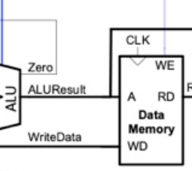

# Individual contribution    
***Kevin Aubeeluck***

# Table of contents
- Single cycle
	- Data Memory
	- Memory Top
	- F1 vbuddy testbench
- Pipelining
	- Hazard Unit(iteration and top)
	- Integration tests
- Branch prediction(?)

# Single Cycle

## Data memory




$$Figure \ 1$$
Unit was implemented as a ram array but the address must be driven with a 32 bit input(Fig. 1) which was problematic with how I initially implemented the size of the ram array using the address width parameter(Fig. 2).
![[k_fig2.png]](../images/k_img/k_fig2.png)
$$Figure  \ 2$$
The simplest way to solve it was to simply use data width as the sole parameter(Fig. 3) and have my address input be 32 bit. Despite being a clunkier interaction to due unused bits, it saved a lot of trouble when it came to the top module.

![[k_fig3.png]](../images/k_img/k_fig3.png)
$$Figure \ 3$$
The main problem with this memory implementation is Verilog creates a  $2^{32}$ bit memory space(approx. 4gb) which will ended up in the system not posting. Looking at the memory map, I truncated the data memory to be much smaller and properly loaded in the pdf array(fig. 4).

![[k_fig4.png]](../images/k_img/k_fig4.png)
$$Figure \ 4$$
##  Memory top

Using the google test suite to write the test for the memory top module was mostly seamless except for testing interconnect wires. Due to not being an input or an output, I couldn't add it as a test. While this wasn't as much of a problem now due to this being the only interconnect, it would prove to be much more annoying further down the line with pipelining

![[k_fig5.png]](../images/k_img/k_fig5.png)
$$Figure \ 5$$
## F1 vbuddy testbench

Testbench was based on the overall top module of the CPU and the main diagram(fig. 6). Trigger was set to be 1 such that the programme would run as soon as the programme starts. Then we mapped the trigger to the vbuddy flag, notably, we had to use the inverse to keep trigger at 1 past initialisation as vbuddy flag is 0 initially. Inverting the flag doesn't change functionality and it still works as an "on" "off" button

![[k_fig6.png]](../images/k_img/k_fig6.png)
$$Figure \ 6$$
Mistakenly, I had thought that I would have to  mask a0 with 0xFFFF as it was now 32 bit compared to the 16 bit value used in lab 3. After reading the vbuddy.cpp, I saw that it was only (7:0) that were used to display the LEDs and by using 0xFFFF, I was incorrectly using (15:0).

# Pipelined

## Hazard Unit(deprecated) 

Originally, the hazard unit had data forwarding, stalls and flushes for RAW data hazards, LW hazards and BEQ hazards respectively. The design was based on the MIPS implementation of the hazard unit with care to transferability to RISC-V architecture. 


### Data forwarding 

![[k_fig7.png]](../images/k_img/k_fig7.png)

$$Figure \ 7$$
![[k_fig8.png]](../images/k_img/k_fig8.png)
$$Figure \ 8$$
Above(fig.7/8) is details the basic logic of forwarding between the Execute and Memory stages. A multiplexer is introduced into the execute stage such that we can decide to route the previous ALU calculation through controlling of ForwardAE/BE. The multiplexer takes 3 inputs, register carry from decode, carry from memory and carry from writeback allowing for forwarding from both stages.

### Stalls and flushes(lw)

![[k_fig9.png]](../images/k_img/k_fig9.png)$$Figure \ 9$$
![[k_fig10.png]](../images/k_img/k_fig10.png)$$Figure \ 10$$
Lwstall controls StallF, StallD and FlushE and is a 1 whenever we load a word (ResultSrcE = 2b'01, from the RISC-V I-type load instruction) and if either Rs1D or Rs2D is equal to the RS1E, then we forward(fig.8). The first condition is self explanatory but the second condition is actually due modified due to the RISCV instruction set for load(fig. 11 & 12).  The location where the memory location is only dependant on rs1 so it presents a data hazard hence we check for equality for forwarding.

![[k_fig11.png]](../images/k_img/k_fig11.png)
$$Figure \ 11$$
![[k_fig12.png]](../images/k_img/k_fig12.png)
$$Figure \ 12$$
This fixes the lw data hazard because we stall for long enough to load the updated word and we put our execute stage in a bubble through the flush.

### Stalls and flushes(beq)

![[k_fig13.png]](../images/k_img/k_fig13.png)
$$Figure \ 13$$

```$
ForwardAD = (Rs1D != 0)  && (Rs1D == WriteRegM)  && RegWriteM;

ForwardBD = (Rs2D != 0)  && (Rs2D == WriteRegM)  && RegWriteM;

  

branchstall = (BranchD  && RegWriteE  && (WriteRegE == Rs1D || WriteRegE == Rs2D))  || (BranchD  && ResultSrcM == 2'b01  && (WriteRegM == Rs1D || WriteRegM == Rs2D));
```

$$Figure \ 14$$
We have to stall in cases of branch misprediction and moving an equality checker(fig. 13) to decode allows us to stall for only 1 cycle instead of 3. The equality checker introduces a raw data hazard which is solved very easily with data forwarding making the first two lines(fig. 14) standard forwarding.

The branch stall checks for branching ($BranchD$) , checks if we write our result ($RegWriteE$) and then checks if we are using a register just modified ($WriteRegE == Rs1D || WriteRegE  == Rs2D$).
The second line implements the same thing with the difference being it occurring in the memory section rather than the execute. Note that ResultSrcM = 2'b01 when we branch

## Hazard Unit(cut down) 

![[k_fig14.png]](../images/k_img/k_fig14.png)
$$Figure \ 14$$

We cut the hazard unit down to just forwarding and abandoned stalling and flush as we determined we could just flush the instruction depending on the external inputs to the cpu(trigger mapping to stall and reset mapping to flush). 

We did not have to consider beq hazards as due to being calculated in the execute stage(fig. 15), we only get a 1 cycle stall hence no need to relocate it to the decode meaning we can disregard the second forwarding.  Using trigger as the stall implements the stall for the 2 cycle lw delay and the reset being used as a flush works due to it being a 1 cycle stall.

![[k_fig15.png]](../images/k_img/k_fig15.png)
$$Figure \ 15$$


# Integration Tests

## Overall test philosophy

I work to store expected distinct values of specific instructions such that any arithmetic differences would indicate what instruction is faulty  

## Shift test

Tests over all shift instructions for both positive and negative numbers
- SRL, SLL, SRLI, SLLI, SRA, SRAI 
- Notable roadblocks:
	- Challenge to design the programme to fit between 6 registers 

## Logic test

Tests over all remaining logic instruction 
- And, Or, Xor, Andi, Ori, Xori ]
- Notable roadblocks:
	- Initially tried to use higher bit values but this added nothing to the test other than making sanity checks more difficult


## Load test

Tests over all Load/Store Operations 
- LW, LH, LB, LWU, LHU, SD, SW, SH, SB
- Notable roadblocks:
	- Initially used high value addresses, unintentionally accessing memory likely reserved by the system 
	- When using stores, I initially forgot that memory offsets occur in multiples of 4 which lead to me accessing the invalid memory addresses
	- lh,lb expected values were calculated incorrectly, erroneously taking the top 16 and 8 bits respectively instead of the bottom 
	- Did not account for unsigned loads being non sign extended
    