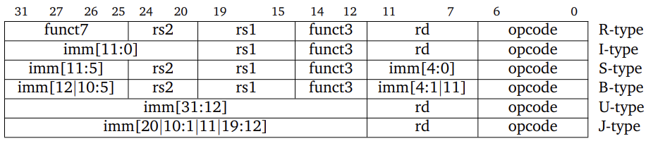
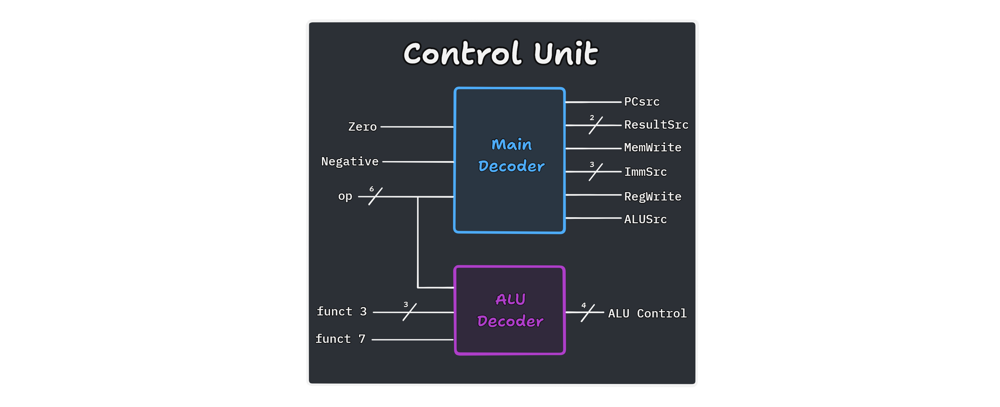
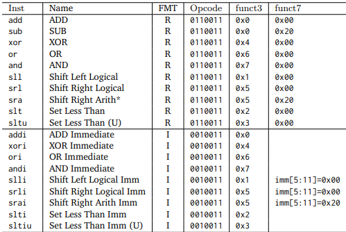
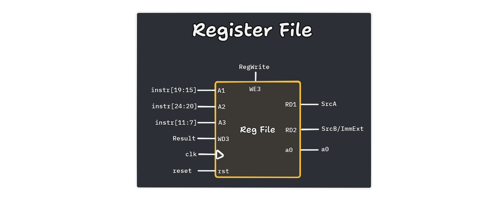
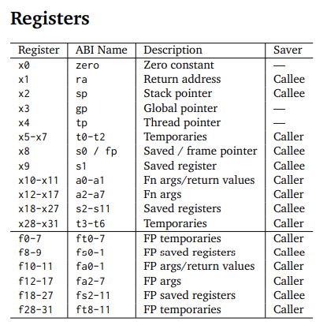

# Personal Statement of Contributions

***Partha Khanna***

---

## Overview

- [[#Single Cycle RISCV-32I Design]]
	- [[#Sign Extension Unit]]
	- [[#Control Unit]]
	- [[#Register File]]
	- [[#Single cycle CPU assembling and testing]]
		- [[#F1 Assembly]]
		- [[#Probability Distribution Function]]
		- [[#System Debugging]]
- 

---

# Single Cycle RISCV-32I Design
## Sign Extension Unit
[System Verilog](../rtl/data/sign_extend) | [Testbench with test cases](../tb/our_tests/signextend_test_tb.cpp) | [Shell script for testing](../tb/bash/sign_extend_test.sh)
### Aims
- Create a module that will sign extend the immediate value.
- However, the problem we face here is that there are many types of instructions, each with a different arrangement for the immediate to be sign extended

### Implementation
Using what I created in the reduced RISC-V CPU (lab 4), I extended this to include all other instruction types. This meant using `ImmSrc` for 5 different instruction types (excluding R-type since it has no immediate).

The following structure was used for each of the instruction types:



We can do this by using a `select case` statement which concatenates different parts of the instruction to form the immediate.
The `ImmSrc` is taken from the control unit which send the value of this as per the opcode.

Considering that there are 5 instructions `I-type`, `S-type`, `B-type`, `U-type`, `J-type`, we have 2 options - therefore requiring 3 bits for `ImmSrc` as shown below.

| **`ImmSrc`** | **Instruction Type** |
| --- | --- |
| `000` | Immediate |
| `001` | Store |
| `010` | Branch |
| `011` | Jump |
| `100` | Upper Immediate |
### Testing
Using G-test to check whether this works following the basic framework along with a test block for each of the instruction types and by manually finding an expected solution.
An example for this is for U-type:

```cpp
TEST_F(SignExtensionTest, Utype) {    
		dut->instr = 0xff600313;
		dut->ImmSrc = 0b011;    
		evaluate();    
		EXPECT_EQ(dut->ImmOp, 0xFFFFF600);
}
```

---
## Control Unit
[System Verilog](../rtl/data/control.sv) | [Testbench with test cases](../tb/our_tests/control_test_tb.cpp) | [Shell script for testing](../tb/bash/control_test.sh)
### Aims
- Create a module that will take in the 32 bit instruction and produce the required signals that depend on the `op` (opcode), `funct3`, `funct7` (part of instruction) and the flags `zero` and `negative`.
### Implementation
The inputs and outputs of the system are:
- Inputs
    - `op` - The 7 bit opcode that is the classification for the instructions
    - `funct3` - defining the type of instruction under the classification (within `op`)
    - `funct7` - More specific instruction classification (not always required) - 2nd MSB of instr
    - `zero` - flag for when 2 entities are equal
    - `negative` - flag for when a value is less than 0 (MSB is 1 for signed 2s complement values)
- Outputs
    - `PCsrc` - immediate (0) vs pc + 4 (1) for program counter increment
    - `ResultSrc` - data to store in register file
    - `MemWrite` - write enable to data mem
    - `ALUcontrol` - controls the operation to perform in the ALU
    - `ALUSrc` - immediate vs register operand for ALU
    - `ImmSrc` - Type of sign extend performed based on instruction type
    - `RegWrite` - enable for when to write to a register

The image below shows the structure for this and the table below shows the value for each of the control bits:



| **Instruction Type** |   **`PCSrc`**   | **`ResultSrc`** | **`MemWrite`** |  **`ALUcontrol`**   | **`ALUSrc`** | **`ImmSrc`** | **`RegWrite`** |
| -------------------- | :-------------: | :-------------: | :------------: | :-----------------: | :----------: | :----------: | :------------: |
| R-type               |       `0`       |      `00`       |      `0`       | `get_ALU_control()` |     `0`      |    `XXX`     |      `1`       |
| I-type (ALU)         |       `0`       |      `00`       |      `0`       | `get_ALU_control()` |     `1`      |    `000`     |      `1`       |
| I-type (load)        |       `0`       |      `01`       |      `0`       |       `0000`        |     `1`      |    `000`     |      `1`       |
| I-type (`jalr`)      |       `1`       |      `10`       |      `0`       |       `0000`        |     `1`      |    `000`     |      `1`       |
| S-type               |       `0`       |      `XX`       |      `1`       |       `0000`        |     `1`      |    `001`     |      `0`       |
| B-type               | as per `funct3` |      `XX`       |      `0`       |       `0001`        |     `0`      |    `010`     |      `0`       |
| J-type (`jal`)       |       `1`       |      `10`       |      `0`       |       `XXXX`        |     `X`      |    `011`     |      `1`       |
| U-type (`lui`)       |       `0`       |      `11`       |      `0`       |       `XXXX`        |     `X`      |    `100`     |      `1`       |
| U-type (`auipc`)     |       `0`       |      `00`       |      `0`       |       `0000`        |     `1`      |    `100`     |      `1`       |

**PCSrc:**
The value for `PCSrc` in the branch instruction type depends on the value for `funct3` which can be implemented with the flags `zero` and `negative` 

```verilog
case (funct3)
	    3'b000: PCsrc = zero; // beq
	    3'b001: PCsrc = ~zero; // bne
	    3'b100: PCsrc = negative; // blt 
	    3'b101: PCsrc = ~negative; // bge
	    3'b110: PCsrc = negative; // bltu
	    3'b111: PCsrc = ~negative; // bgeu
	    default: PCsrc = 1'b0; // Default case
endcase
```

If `PCSrc` is 0, the program counter increments to the next instruction (with byte addressing this is PC + 4). If `PCSrc` is 1, the program counter increments to PC + immediate.

**ALUcontrol:**
The value for `ALUcontrol` is determined by `get_ALU_control()` for R-type and I-type (alu) instructions. When designing this it is important that we have parameters addressed by reference, but it is not critical to return a value making a systemVerilog task better in this scenario than a function.

```systemVerilog
case (funct_3)
      3'd0: if (op_code == 7'b0010011) ALU_control = 4'b0000;
            else                       ALU_control = funct_7 ? 4'b0001 : 4'b0000; // add | addi (funct7 = 0) or sub (funct7 = 1)
      3'd1: ALU_control = 4'b0101; // sll | slli
      3'd2: ALU_control = 4'b1000; // slt | slti
      3'd3: ALU_control = 4'b1001; // sltu | sltiu
      3'd4: ALU_control = 4'b0100; // xor | xori
      3'd5: ALU_control = funct_7 ? 4'b0110 : 4'b0111; // srl | slri (funct7 = 0) or sra | srai (funct7 = 1)
      3'd6: ALU_control = 4'b0011; // or | ori
      3'd7: ALU_control = 4'b0010; // and | andi
      default: ALU_control = 4'b0000; // undefined
  endcase
```

Which satisfies the following implementation as per the RISC-V 32I base instructions:



**ResultSrc:**
`ResultSrc` was initially defined as 1 bit as the select signal for the result which is written into the regfile on the next clock cycle. When this is:

- `0`, `ALUResult` is written back for R-type, I-type (ALU) and branch comparisons.
- `1`, `ReadData` is written back for I-type (load) instructions.

However this poses a problem since jump instructions cannot be implemented. therefore, we make use of this revised model with a 2-bit value:

- `00` and `01` are equivalent to previous
- `10`, PC + 4 is stored for jump instructions like `jal` and `jalr` to store the return address in the register before jumping to a new target address
- `11`, when storing upper immediate values into the registers for `lui` and `auipc`

### Testing
Using G-test for the following test cases:
- R-type Instruction
    - inputs: opcode `0110011`, `funct3` = `000`, `funct7` = `0`
    - outputs: `RegWrite = 1`, `ALUSrc = 0`, `MemWrite = 0`, `ResultSrc = 00`, `PCsrc = 0`, `ALUcontrol = 0000` (Add)
- I-Type Addi Instruction
    - inputs: opcode `0010011`, `funct3` = `000`, `funct7` = `0`
    - outputs: `RegWrite = 1`, `ALUSrc = 1`, `MemWrite = 0`, `ResultSrc = 00`, `PCsrc = 0`, `ALUcontrol = 0000` (Add immediate)
- I-Type Load Instruction
    - inputs: opcode `0000011`, `funct3` = `010`, `funct7` = `0`
    - outputs: `RegWrite = 1`, `ALUSrc = 1`, `MemWrite = 0`, `ResultSrc = 01`, `PCsrc = 0`, `ALUcontrol = 0000` (Add for address calculation)
- B-Type Branch Equal
    - inputs: opcode `1100011`, `funct3` = `000`, `zero` = `1`
    - outputs: `RegWrite = 0`, `MemWrite = 0`, `PCsrc = 1` (Branch taken), `ALUcontrol = 001` (Subtraction)
- J-Type Jal
    - inputs: opcode `1101111`
    - outputs: `RegWrite = 1`, `MemWrite = 0`, `PCsrc = 1` (Jump), `ResultSrc = 10` (PC + 4)
- Default Case
    - inputs: opcode `1111111`
    - outputs: `RegWrite = 0`, `MemWrite = 0`, `ResultSrc = 00`, `PCsrc = 0`, `ALUcontrol = 0000` (Default)

---

## Register File
[System Verilog](../rtl/data/reg_file.sv) | [Testbench with test cases](../tb/our_tests/reg_file_test_tb.cpp) | [Shell script for testing](../tb/bash/reg_file_test.sh)
### Aims
- Design an array to store 32 32-bit registers including the zero register (x0) hardwired to 0.
- Asynchronous Reads and Synchronous Writes to minimise delays
### Implementation
Inputs, outputs and Parameters used here are:

- Parameters:
    - `DATA_WIDTH = 32` to specify the bit width of the registers
    - `ADDR_WIDTH = 5` to specify the number of registers.
- Inputs:
    - `clk` to synchronise writes
    - `reset` used to clear all registers
    - `write_enable` (`WE3`) control signal to enable writing to a register
    - `read_addr1` (`A1`) and `read_addr2` (`A2`) addresses for the read ports
    - `write_addr` (`A3`) write port address
    - `write_data` (`WD3`) Data to write into the register specified by `write_addr`
- Outputs:
    - `read_data1` (`RD1`) and `read_data2` (`RD2`) contains the data read from the specified registers
    - `a0` - debug the output for monitoring register 10



The registers are first created as an array by:

```systemVerilog
logic [DATA_WIDTH-1:0] registers [2**ADDR_WIDTH-1:0];
```

The entire RISC-V CPU makes use of all 32 32-bit registers with some kept for a specific purpose and others for temporary and other usage as described here:



This is also specified here: [https://en.wikichip.org/wiki/risc-v/registers](https://en.wikichip.org/wiki/risc-v/registers)

**Reading:**

```systemVerilog
assign read_data1 = registers[read_addr1];
assign read_data2 = registers[read_addr2];
```

**Writing:**

This is in sequential logic, on the positive/rising clock edge, values are written to the specified register as long as write enable is high and the write address is not 0 (pointing to x0 which is hardwired to 0)

This encourages efficient operand access with dual read ports, useful for R-type instructions, compliant with RISC-V standard since x0 is not modified, reset functionality exists to provide a clean initial state for the processor and in case it needs to be reinitialised at any point, produces an output `a0` which may be utilised for debugging.

### Testing
- Reset Test
    - inputs: `reset = 1`, then `reset = 0`
    - outputs: All registers are `0`
- Write and Read Valid Register
    - inputs: `write_addr = 1`, `write_data = 0xA5A5A5A5`, `write_enable = 1`, `clk ↑`; then `read_addr1 = 1`
    - outputs: `read_data1 = 0xA5A5A5A5`
- Write and Read Another Register
    - inputs: `write_addr = 2`, `write_data = 0xDEADBEEF`, `write_enable = 1`, `clk ↑`; then `read_addr2 = 2`
    - outputs: `read_data2 = 0xDEADBEEF`
- Write to Register 0 Should Not Change
    - inputs: `write_addr = 0`, `write_data = 0x12345678`, `write_enable = 1`, `clk ↑`; then `read_addr1 = 0`
    - outputs: `read_data1 = 0`
- Reset After Write Operations
    - inputs: `write_addr = 1`, `write_data = 0xA5A5A5A5`, `write_enable = 1`, `clk ↑`; then `reset = 1`, `clk ↑`, `reset = 0`
    - outputs: All registers are `0`
- Write and Read Multiple Registers
    - inputs: `write_addr = 1`, `write_data = 0x1`, `write_enable = 1`, `clk ↑`; then `write_addr = 2`, `write_data = 0x2`, `clk ↑`; then `read_addr1 = 1`, `read_addr2 = 2`
    - outputs: `read_data1 = 0x1`, `read_data2 = 0x2`
- Write and Read From Same Register
    - inputs: `write_addr = 3`, `write_data = 0xDEADBEEF`, `write_enable = 1`, `clk ↑`; then `read_addr1 = 3`, `read_addr2 = 3`
    - outputs: `read_data1 = 0xDEADBEEF`, `read_data2 = 0xDEADBEEF`
- Write With Multiple Clocks
    - inputs: `write_addr = 4`, `write_data = 0x12345678`, `write_enable = 1`, `clk ↑`; then `read_addr1 = 4`
    - outputs: For 3 cycles after the write, `read_data1 = 0x12345678`

### Potential Enhancements
- Clock gating for Power efficiency. In a low power concept, clock gating (disabling the clock) can be added to disable write operations for when `write_enable` is low.
- Verify that the address is less than 32 for writing
- Use other addresses for output as defined above - registers which return a value are also `a1`, `f10`, `f11`

---
## Single cycle CPU assembling and testing
After the individual components had been designed and tested, I assembled them into the `data_top.sv` file which is the top module for the control unit, sign extension and register file.

This was then incorporated by @Joel into the `top.sv` which is the model of the CPU at this stage.

This was then tested through the following test cases (assembly, shell scripts and testbench) that were already provided:
1. `addi bne`: initialising registers, incrementing values, comparing values with conditional branching
2. `li add`: handling loading large signed and unsigned values and performing addition
3. `lbu sb`: storing bytes, loading unsigned bytes and adding the loaded values
4. `jal ret`: using `jal`(jump and link) and `ret` (a special case of `jalr x0, ra, 0`) to add numbers and output a result
5. `pdf`: counting occurrences of data values  and computing the sum  for different probability distribution functions.
There were 2 tests for which extra work was done by @Joel and myself:
### F1 Assembly
I created the program to test the F1 lights as per previous lab work. The basic version tests the lights sequences whereas a more advanced version tests this using a random delay (the pseudorandom binary value generated by the lfsr module)

This can be found here ==(add link)==

The video for its functionality can be found on the team statement
### Probability Distribution Function
We then tested the system by creating a test bench for various `*.mem` files provided as the input for `pdf.s`. This included `noisy.mem`, `gaussian.mem` and `triangle.mem`. The videos can be found on the team statement.

### System Debugging
As a result of testing and debugging (using gtkwave), we found out that there were certain issues which were debugged, with the following being the notable changes:
- `jal` uses byte addressing so has an assumed `0` at the LSB position, which was implemented.
- `a0` needed to be an output register.
- `PCSrc` currently increments to either the next instruction or branches to another instruction. However, for jumping the target is the immediate field. However by using a 4x2 mux, it not only uses extra hardware but also results in a vacant space for `PCSrc = 11`. This is useful later on for when a stall is required, which can be pre-emptively addressed here:

| `PCSrc` | Program counter    | Action                                                       |
| ------- | ------------------ | ------------------------------------------------------------ |
| `00`    | `PC = PC + 4`      | Go to next instruction                                       |
| `01`    | `PC = PC + Target` | Branch to another instruction (relative to current position) |
| `10`    | `PC = imm`         | Jumping to another position regardless of current position   |
| `11`    | `PC = PC`          | PC stall (repeat current PC cycle)                           |

- `Trigger` was also used but the current implementation would stall at the current program counter, but this implementation is not sufficient for all opcodes as it will continue adding/subtracting during the stall. This can be solved by routing trigger through the control unit to ensure that the default values are instated (with no writing to registers/memory).

---
# Pipelined RISCV-32I Design

controlmunit


| `branch` | logic     |
| -------- | --------- |
| `000`    | No branch |
| `001`    | beq       |
| `010`    | bne       |
| `100`    | blt       |
| `101`    | bge       |
| `110`    | bltu      |
| `111`    | bgeu      |
`branch` not used is `011`
This implementation uses the logic:
- if branch = 0 then no branching
- if branch != 0:
	- MSB = 0: use zero flag
	- MSB = 1: use negative flag

jump:


| `jump` | logic         |
| ------ | ------------- |
| `00`   | no jump       |
| `01`   | `jal`         |
| `10`   | `jalr`        |
| `11`   | trigger/stall |


---
# Data Memory Cache Implementation


---
# Complete RISCV-32I Design
